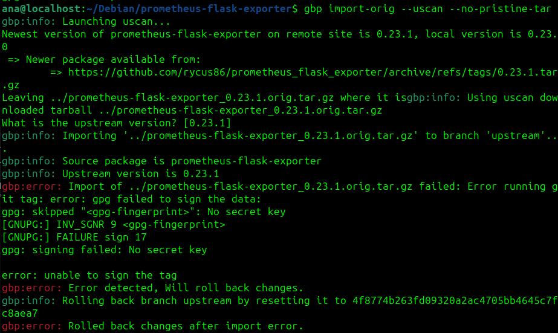

## Sprint 1

### Pacote 101

- Foi entregue o .zip no link solicitado.

### Issue: Package prometheus-flask-exporter #348

- [Link para Issue 348](https://salsa.debian.org/debian-brasil-team/docs/-/issues/348)

### Erro

- Foi feita toda a configuração normalmente mas houve um erro ao atualizar o pacote, com o comando **gbp import-orig --uscan --pristine-tar**

    

| Versão |    Data    |      Descrição       |                   Autor(es)                   |
| :----: | :--------: | :------------------: | :-------------------------------------------: |
| `1.0`  | 28/11/2024 | Criação de documento | [Ana Beatriz](https://github.com/ananorberto) |
