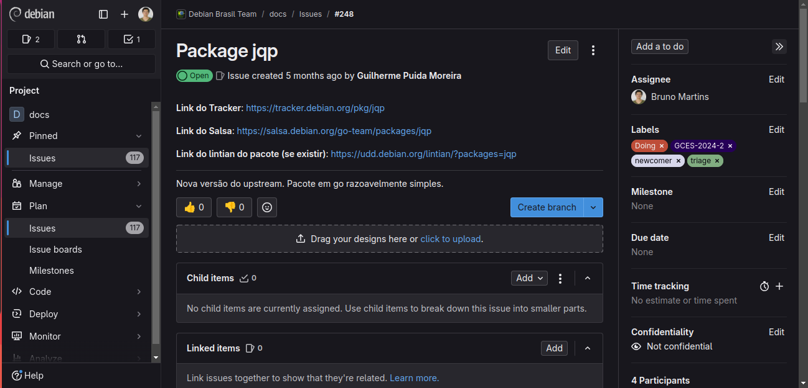
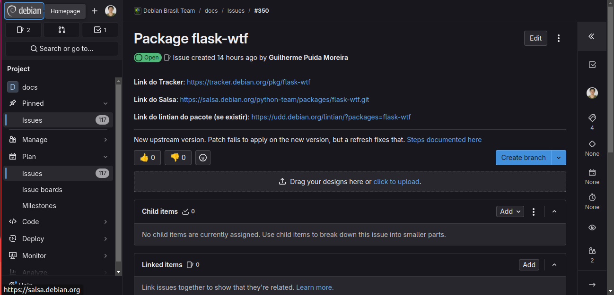

# Bruno Martins
Relatório referente às atividades desenvolvidas na primeira sprint do projeto Debian.

## Pacotes
### Empacotamento 101
Pacote inicial proposto como uma introdução ao projeto de empacotamento.

- Status: **Done**

### jqp
A TUI playground for exploring jq.

- Issue: [#248](https://salsa.debian.org/debian-brasil-team/docs/-/issues/248)
- Status: **Doing**

Figura 1: Issue da jpq (Fonte: Bruno Martins). 

- Comentários: Estou enfrentando algum problemas de compatibilidade com algumas bibliotecas específicas em go, requerendo algumas adaptações mais avançadas na configuração do meu ambiente. No entanto, o trabalho já está meio caminho andado.

### flask-wtf
[Flask-wtf](https://flask-wtf.readthedocs.io/en/1.2.x/) é um pacote python que busca integrar as bibliotecas Flask and WTForms.

- Issue: [#350](https://salsa.debian.org/debian-brasil-team/docs/-/issues/350)
- Status: **To do**

Figura 2: Issue do flask-wtf (Fonte: Bruno Martins). 

- Comentários: O pacote **flask-wtf** foi postado recentemente (28/11 às 00h) pelo nosso meta-coach, o Guilherme Puida. Portanto, não houve tempo suficiente para desenvolver o pacote.

## Histórico de Versões
| Versão |    Data    |      Descrição       |                   Autor(es)                   |
| :----: | :--------: | :------------------: | :-------------------------------------------: |
| `1.0`  | 28/11/2024 | Criação de documento | [Bruno Martins](https://github.com/gitbmvb) |