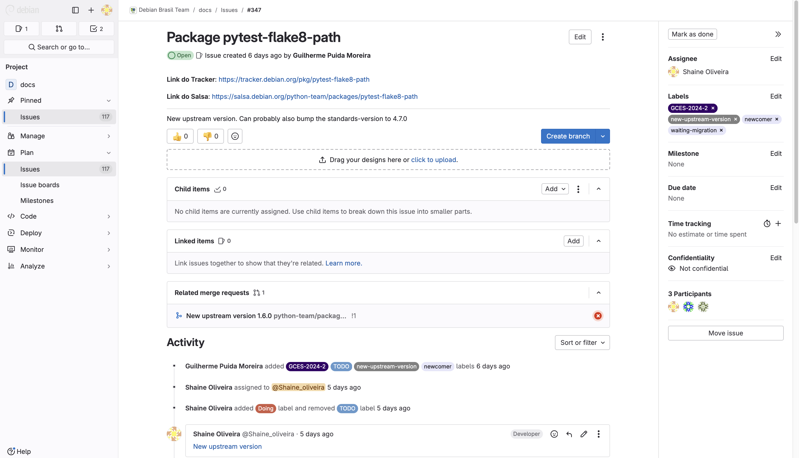
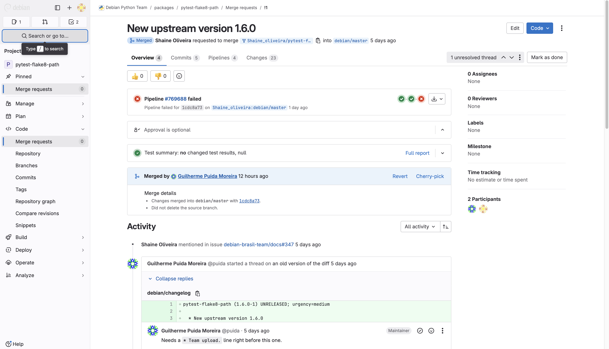

## Sprint 1

### Pacote pytest-flake8-path #347

- Foi gerado a nova atualização do upstream para o pacote pytest-flake8-path. Essa primeira contribuição foi feita em conjunto com a [Shaíne Oliveira](https://github.com/ShaineOliveira), portanto nossas páginas se tratam do mesmo pacote.

[Link do Pacote - Issue](https://salsa.debian.org/debian-brasil-team/docs/-/issues/347)

### Merge Request

- O Merge Request foi revisado e ajustes foram solicitados.
- Foi identificado que o changelog precisava incluir a entrada "Team upload." para seguir as convenções da equipe.
- A versão dos padrões (Standards-Version) estava desatualizada e foi recomendada a atualização para 4.7.0.
- As modificações foram feitas e o Merge Request foi aceito.

[Merge Request](https://salsa.debian.org/python-team/packages/pytest-flake8-path/-/merge_requests/1)

### Comentários.
A geração do novo upstream do pacote foi realizada em dupla, devido à quantidade insuficiente de pacotes disponíveis com a tag "GCES-2024-2" para atender a todos os integrantes do grupo nesta primeira sprint. Além disso, os pacotes de semestres anteriores já estavam sendo utilizados por outras pessoas.

| Versão |    Data    |         Descrição          |  Autor(es)  |
| :----: | :--------: | :------------------------: | :---------: |
| `1.0`  | 28/11/2024 | Criação de documento | [Luan Mateus](https://github.com/luanduartee) |
