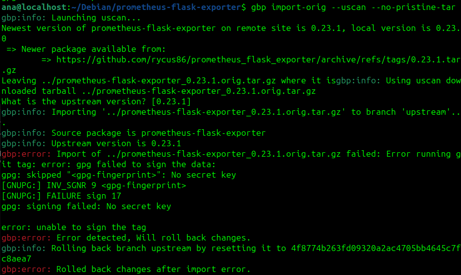

# Sprint 2

## **Issue: Package prometheus-flask-exporter #348**

- [Link para Issue 348](https://salsa.debian.org/debian-brasil-team/docs/-/issues/348)


## **Prometheus-Flask-Exporter**


---

Pacote Python que integra o **Prometheus** com aplicações **Flask**.

### **Prometheus**:

Ferramenta de monitoramento e alerta para sistemas em tempo real, especialmente em **arquiteturas de microserviços**.

### **Flask**:

Framework **minimalista** para desenvolvimento web em Python, ideal para criar **aplicações leves e flexíveis**.

### **Integração Prometheus e Flask**
Quando usados juntos, o **prometheus-flask-exporter** expõe métricas detalhadas de aplicações **Flask** (como número de requisições e tempo de resposta) no formato que o **Prometheus** pode monitorar e armazenar.

--- 

# Erro (Sprint 1)

- Na [Sprint 1](../sprint1/ana1.md) não foi possivel fazer a new upstream version por causa do erro com a chave **gbp**.

```
gbp import-orig --uscan --pristine-tar
```



### Erro corrigido

Este erro foi corrigido alterando o `~/.gbp.conf`

```ini
$ cat ~/.gbp.conf 

[DEFAULT]
builder = sbuild
pristine-tar = True
sign-tags = True //alterar para False
keyid = <gpg-fingerprint> //Remover linha

$ cat ~/.gbp.conf 
[DEFAULT]
builder = sbuild
pristine-tar = True
sign-tags = False
```
## Merge Request Feito - New upstream version 0.23.1

- [Link para o MR](https://salsa.debian.org/python-team/packages/prometheus-flask-exporter/-/merge_requests/5). (Esperando aprovação...)


| Versão |    Data    |      Descrição       |                   Autor(es)                   |
| :----: | :--------: | :------------------: | :-------------------------------------------: |
| `1.0`  | 28/11/2024 | Criação de documento | [Ana Beatriz](https://github.com/ananorberto) |
