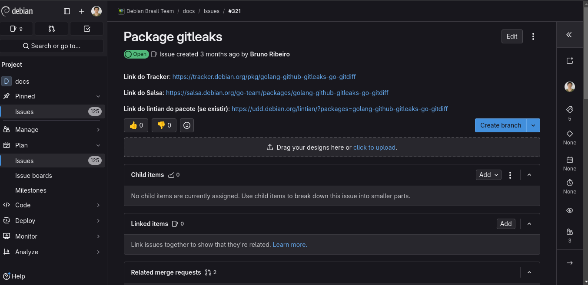
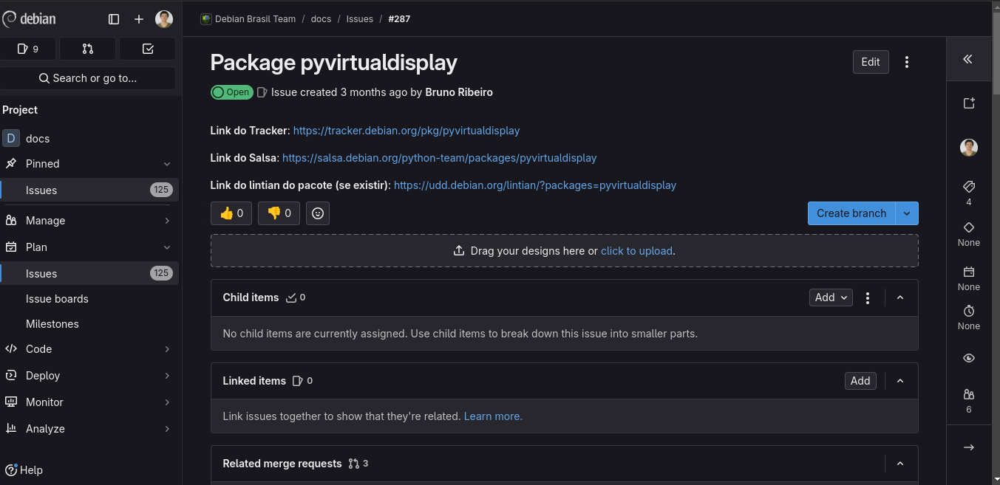
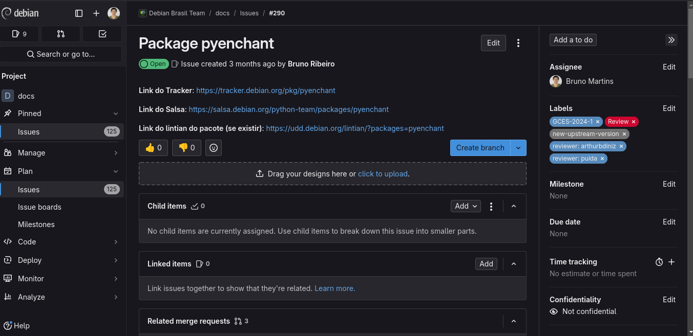
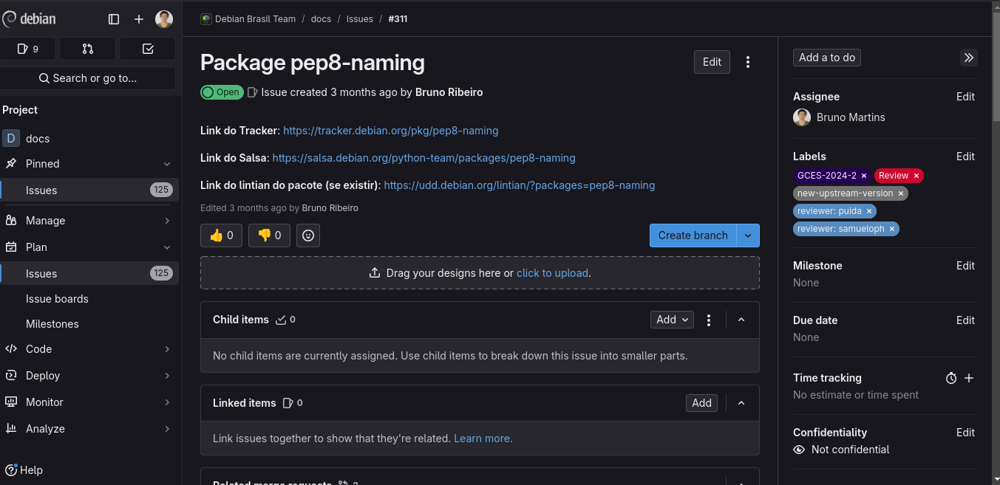
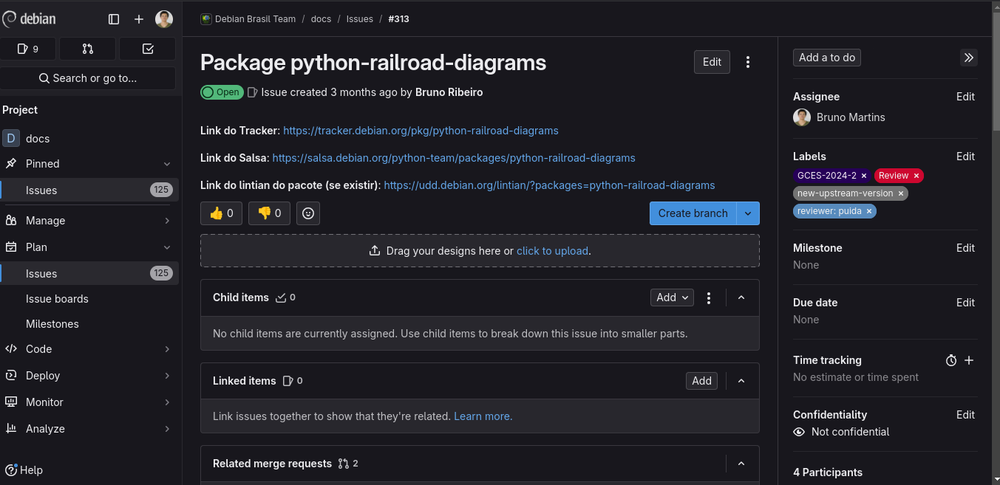
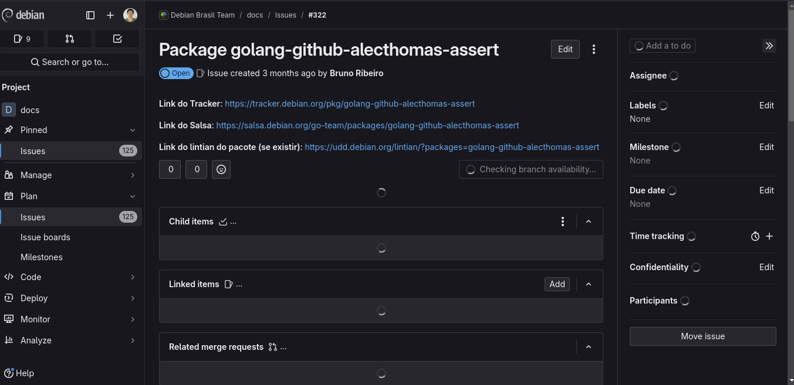
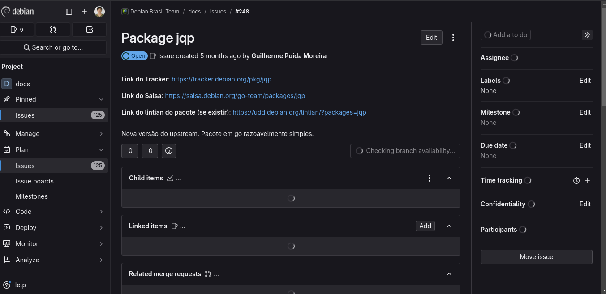
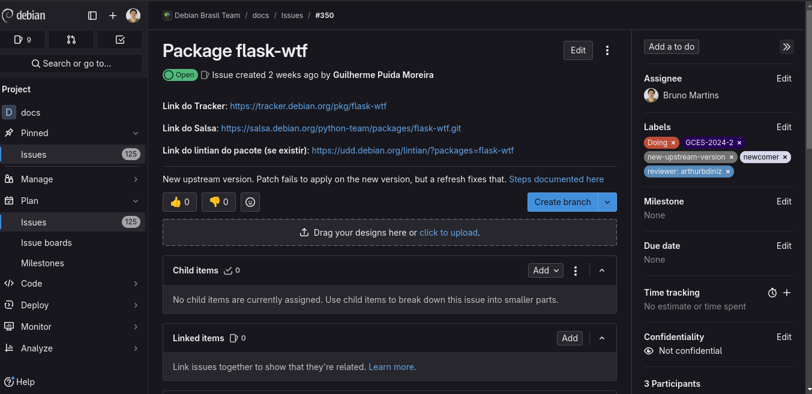

# Bruno Martins - Sprint 2

## Pacotes da Sprint 2
### 1. go-gitdiff
- Descrição: A Go library for parsing and applying patches generated by git diff, git show, and git format-patch. It can also parse and apply unified diffs generated by the standard diff tool.
- Status (11/12/2024 às 23h44): **Review**
- Tipo: Atualização da versão upstream
- Revisores: Guilherme Puida e Arthur Diniz
- Issue [#321](https://salsa.debian.org/debian-brasil-team/docs/-/issues/321)
- [Merge Request](https://salsa.debian.org/go-team/packages/golang-github-gitleaks-go-gitdiff/-/merge_requests/3)

### 2. pyvirtualdisplay
- Descrição: pyvirtualdisplay is a python wrapper for Xvfb, Xephyr and Xvnc.
- Status (11/12/2024 às 23h44): **Review**
- Tipo: Atualização da versão upstream
- Revisores: Guilherme Puida
- Issue [#287](https://salsa.debian.org/debian-brasil-team/docs/-/issues/287)
- [Merge Request](https://salsa.debian.org/python-team/packages/pyvirtualdisplay/-/merge_requests/3)

### 3. pyenchant
- Descrição: This package provides a set of Python language bindings for the Enchant spellchecking library.
- Status (11/12/2024 às 23h44): **Review**
- Tipo: Atualização da versão upstream
- Revisores: Guilherme Puida e Arthur Diniz
- Issue [#290](https://salsa.debian.org/debian-brasil-team/docs/-/issues/290)
- [Merge Request](https://salsa.debian.org/python-team/packages/pyenchant/-/merge_requests/3)

### 4. pep8-naming
- Descrição:  
- Status (11/12/2024 às 23h44): **Review**
- Tipo: Atualização da versão upstream
- Revisores: Guilherme Puida e Samuel Henrique
- Issue [#311](https://salsa.debian.org/debian-brasil-team/docs/-/issues/311)
- [Merge Request](https://salsa.debian.org/python-team/packages/pep8-naming/-/merge_requests/3)

### 5. python-railroad-diagrams
- Descrição: This is a small library for generating railroad diagrams (like what JSON.org uses) using SVG, with both JS and Python ports. Railroad diagrams are a way of visually representing a grammar in a form that is more readable than using regular expressions or BNF. They can easily represent any context-free grammar, and some more powerful grammars. There are several railroad-diagram generators out there, but none of them had the visual appeal I wanted, so I wrote my own.

- Status (11/12/2024 às 23h44): **Review**
- Tipo: Atualização da versão upstream
- Revisores: Guilherme Puida
- Issue [#313]()
- [Merge Request](https://salsa.debian.org/python-team/packages/python-railroad-diagrams/-/merge_requests/3)

### 6. golang-github-alecthomas-assert
- Descrição:  
- Status (11/12/2024 às 23h44): **Review**
- Tipo: Atualização da versão upstream
- Revisores: Guilherme Puida
- Issue [#322](https://salsa.debian.org/debian-brasil-team/docs/-/issues/322)
- [Merge Request](https://salsa.debian.org/go-team/packages/golang-github-alecthomas-assert/-/merge_requests/3)

## Pacotes da Sprint 1 (atualização)

### 7. jqp

- Descrição: a TUI playground for exploring jq.
- Status (11/12/2024 às 23h44): **Review**
- Tipo: Atualização da versão upstream
- Revisores: Guilherme Puida e Arthur Diniz
- Issue [#248](https://salsa.debian.org/debian-brasil-team/docs/-/issues/248)
- [Merge Request](https://salsa.debian.org/go-team/packages/jqp/-/merge_requests/4)

### 8. flask-wtf
- Descrição:  
- Status (11/12/2024 às 23h44): **Doing**
- Tipo: Atualização da versão upstream
- Revisores: Arthur Diniz
- Issue [#350](https://salsa.debian.org/debian-brasil-team/docs/-/issues/350)

| Versão |    Data    |      Descrição       |                   Autor(es)                   |
| :----: | :--------: | :------------------: | :-------------------------------------------: |
| `1.0`  | 12/12/2024 | Criação do documento | [Bruno Martins](https://github.com/gitbmvb) |