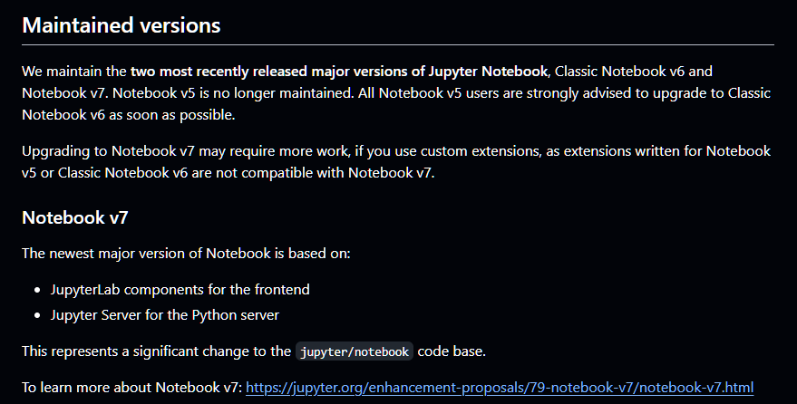
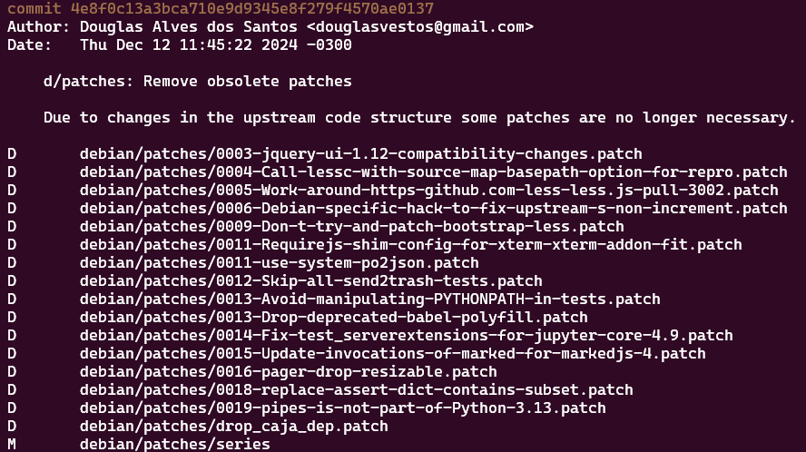
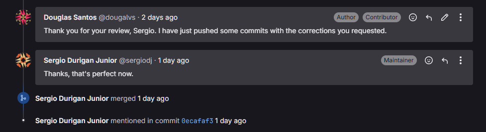
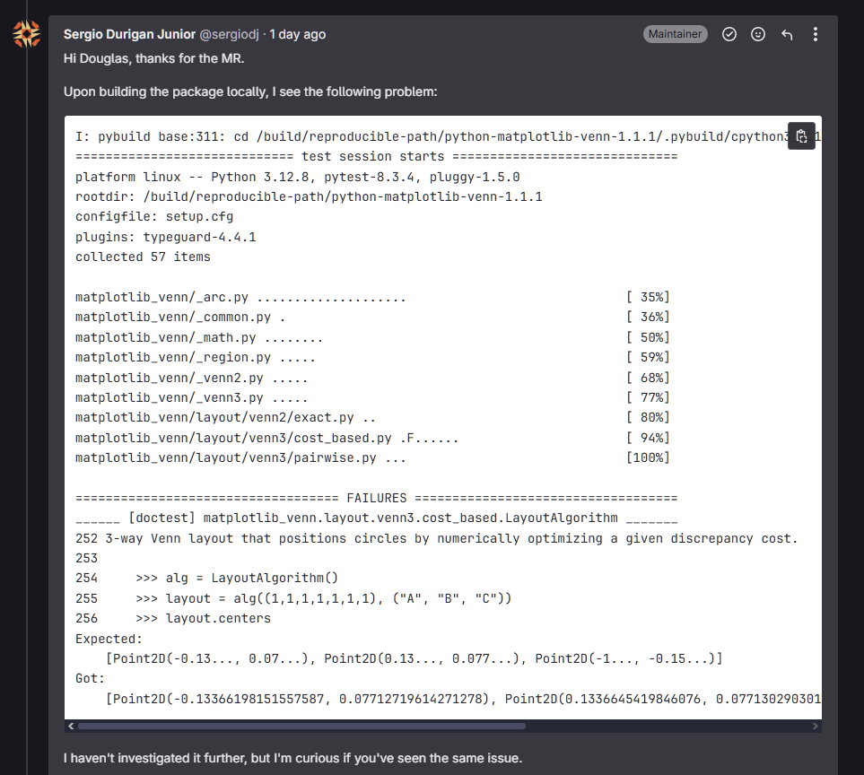

# Douglas Alves

## Pacote jupyter-Notebook

O jupyter-notebook ([repo no salsa](https://salsa.debian.org/python-team/packages/jupyter-notebook)) é um ambiente de notebook baseado em web para computação interativa, amplamente utilizado nas áreas de análise de dados e inteligência artificial. 

## Issue: [#359](https://salsa.debian.org/debian-brasil-team/docs/-/issues/359)

Para a escolha do pacote, foram observadas suas páginas no tracker e no lintian:

* [Link do Tracker](https://tracker.debian.org/pkg/jupyter-notebook)
* [Link do lintian](https://udd.debian.org/lintian/?packages=jupyter-notebook)
 
Um primeiro ponto observado foi que, diferentemente do pacote da sprint passada, o jupyter-notebook apresentava mais tarefas a serem executadas: mais warnings no lintian, falha na build durante o teste de reprodutibilidade e 18 patches para atualizar pro upstream. Dito isso, a atualização do pacote para nova versão do upstream foi escolhida como um desafio para aprender novos conceitos e técnicas do processo de empacotamento.

### Execução

Seguidos os passos básicos de atualização, partiu-se para a análise dos patches e verificação se esses já haviam sido incorporados no código fonte ou se deviam ser atualizados para a nova versão do upstream. Aqui foi encontrado o primeiro percalço do processo: o código da nova versão estava muito diferente da versão anterior. Verificando-se o repositório oficial do software no github foi encontrado o seguinte:

Em suma, a base de código do software foi significamente modificada na nova versão, com diferenças tanto no lado do front quanto do backend. Sendo assim, boa parte dos patches analisados foram considerados obsoletos e removidos. Com alguns poucos sendo mantidos. Algumas dependências obsoletas também foram removidas.

Contudo, os pontos mais afetados com certeza foram o `debian/control` e o `debian/rules`. O backend de build da aplicação foi mudado, assim como as dependências do frontend. Logo, foi iniciado o processo de reestruturação desses arquivos para refletir as mudanças trazidas com a nova versão.

### Status da issue

Pela magnitude das mudanças a serem feitas, a issue ainda não foi finalizada. Dito isso, foi necessário pausar seu desenvolvimento momentaneamente na sprint 2 para finalização de outras issues.

## Pacote tinydb

O tinydb ([repo no salsa](https://salsa.debian.org/python-team/packages/tinydb)) é um banco de dados leve, otimizado e orientado a documentos, indicado principalmente para aplicativos pequenos e protótipos.

## Issue: [#377](https://salsa.debian.org/debian-brasil-team/docs/-/issues/377)

Para a escolha do pacote, foram observadas suas páginas no tracker e no lintian:

* [Link do Tracker](https://tracker.debian.org/pkg/tinydb)
* [Link do lintian](https://udd.debian.org/lintian/?packages=tinydb)
 
O interessante desse pacote era que, apesar de não ser tão simplório quanto o da primeira sprint, ele também não era tão complexo quanto o jupyter-notebook. Possibilitando-se, assim, exercitar-se alguns pontos interessantes do empacotamento e entregar o pacote ainda nessa sprint.

### Execução

Após se executar os comandos básicos de atualização, os seguintes passos foram seguidos:

* Foi verificada a eligibilidade do pacote para a versão 4.7.0 do Standards-Version, a checklist verificada foi [esta](https://www.debian.org/doc/debian-policy/upgrading-checklist.html) e nenhuma modificação foi necessária para atualização dessa nova versão. 

* Foram adicionadas duas novas dependências (python3-poetry-core e pybuild-plugin-pyproject) ao pacote devido a uma mudança no backend de build.

* Foi documentado no debian/control que o arquivo debian/rules não necessitava de root em sua execução.

* A versão do debian/watch foi atualizada de 3 para 4.

* O patch `collections-abc-mapping.patch` foi removido por já ter sido incluso no código upstream.

### Status da issue

Após a mudanças descritas anteriormente, um [MR](https://salsa.debian.org/python-team/packages/tinydb/-/merge_requests/1?commit_id=28201d6062759cf1103250566f342086d4c03475) foi criado e começou a ser revisado pelo maintainer Sergio Durigan Junior. Em 15/12/2024, o MR foi aceito e o upload foi feito.

## Pacote python-matplotlib-venn

O python-matplotlib-venn ([repo no salsa](https://salsa.debian.org/python-team/packages/python-matplotlib-venn)) é um pacote que disponibiliza rotinas para plotar diagramas de Venn de dois e três conjuntos com pesos de área por meio do uso da biblioteca matplotlib.

## Issue: [#377](https://salsa.debian.org/debian-brasil-team/docs/-/issues/377)

Para a escolha do pacote, foram observadas suas páginas no tracker e no lintian:

* [Link do Tracker](https://tracker.debian.org/pkg/python-matplotlib-venn)
 
As tarefas a serem executadas nesse pacote aparentavam ser bem semelhantes às do tinydb, porém com um número maior de patches.

### Execução

Após se executar os comandos básicos de atualização, os seguintes passos foram seguidos:

* Foi verificada a eligibilidade do pacote para a versão 4.7.0 do Standards-Version, a checklist verificada foi [esta](https://www.debian.org/doc/debian-policy/upgrading-checklist.html) e nenhuma modificação foi necessária para atualização dessa nova versão. 

* Foi adicionada uma novas dependência (pybuild-plugin-pyproject) ao pacote devido a uma mudança no backend de build. E outra (python3-shapely) devido às novas funcionalidades adicionadas ao upstream.

* Os patches `fix_build_time_test.patch` e `numpy_1.14.patch` foram removidos por já terem sido inclusos no código upstream.

* O nome da licença do software foi corrigida no arquivo debian/copyright.

### Status da issue

Após a mudanças descritas anteriormente, um [MR](https://salsa.debian.org/python-team/packages/python-matplotlib-venn/-/merge_requests/1) foi criado e começou a ser revisado também pelo maintainer Sergio Durigan Junior. Porém, a build do pacote pelo maintainer encontrou um erro devido a uma falha nos doctests da aplicação: 

Como esse erro não acontece na minha build local, até o dia 17/12/2024 estamos em contato para chegar a uma solução em conjunto.

## Histórico de Versão

| Versão |    Data    |         Descrição          |  Autor(es)  |
| :----: | :--------: | :------------------------: | :---------: |
| `1.0`  | 17/12/2024 | Criação do documento | [Douglas Alves](https://github.com/dougAlvs) |

