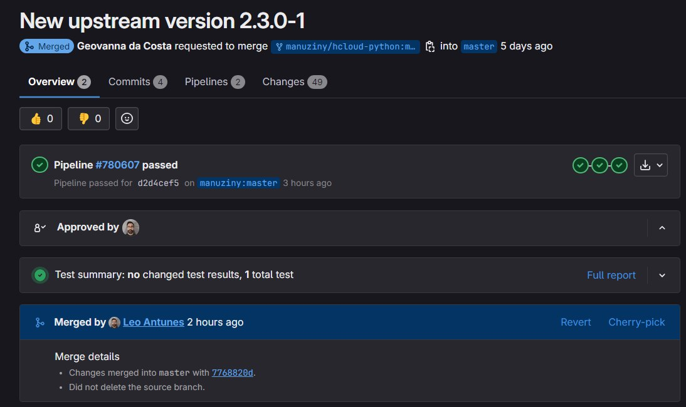

# Sprint 2

# Geovanna Maciel Avelino da Costa
## Issue : [Package hcloud-python](https://salsa.debian.org/debian-brasil-team/docs/-/issues/366)

### Hetzner Cloud
O package da issue trata do Hetzner Cloud, uma empresa especializada em hospedagem e serviços de infraestrutura, que disponibiliza diversas soluções para sites, aplicativos e serviços online. Entre os serviços mais populares da Hetzner Cloud está o VPS (Servidor Virtual Privado).

Essa issue necessitava da atualização do upstream então usei ela pra testar meu conhecimento do que foi feito na sprint anterior. Ocorreu tudo sem problemas, foi bem tranquilo. O MR já está feito e e foi aceito!! Minha primeira contruição no Debian. &#x1F600; &#x1F600; &#x1F600;

* MR: [https://salsa.debian.org/python-team/packages/hcloud-python/-/merge_requests/2](https://salsa.debian.org/python-team/packages/hcloud-python/-/merge_requests/2)
* Repositório no Salsa: [https://salsa.debian.org/python-team/packages/hcloud-python](https://salsa.debian.org/python-team/packages/hcloud-python)

## Issue : [Package micropython-mpremote](https://salsa.debian.org/debian-brasil-team/docs/-/issues/380)

O **MicroPython** oferece módulos integrados que replicam a funcionalidade da biblioteca padrão do Python (como `os` e `time`) e também módulos específicos do MicroPython (como `bluetooth` e `machine`). É uma ferramenta de linha de comando (CLI) oferece um conjunto integrado de utilitários para interagir remotamente e automatizar um dispositivo MicroPython por meio de uma conexão serial. 

Issue atualizada para a nove versão do upstream e também para se encaixar nos padrões de versão 4.7.0; já está para revisão e aguardando o merge.

* MR: [https://salsa.debian.org/python-team/packages/micropython-mpremote/-/merge_requests/1](https://salsa.debian.org/python-team/packages/micropython-mpremote/-/merge_requests/1)
* Repositório no Salsa: [https://salsa.debian.org/python-team/packages/micropython-mpremote](https://salsa.debian.org/python-team/packages/micropython-mpremote)

## Issue : [Package python-consul](https://salsa.debian.org/manuziny/python-consul)

O **Consul** é uma solução distribuída, altamente disponível e consciente de data centers, projetada para conectar e configurar aplicações em infraestruturas dinâmicas e distribuídas.

Esse pacote necessitava de atualização no upstream e um patch. Consegui chegar ao ponto do processo em que eu atualizei o patch, mas apareceram erros que foram se acumulando e virando uma bola de neve que não consegui resolver a tempo. Pretendo fazê-lo com mais calma para tê-lo entregue na próxima sprint.

* Repositório no Salsa: [https://salsa.debian.org/manuziny/python-consul](https://salsa.debian.org/manuziny/python-consul)

## Problemas &#x1F622; &#x1F622;
## Issue : [Package python-agate](https://salsa.debian.org/debian-brasil-team/docs/-/issues/367)

Agate é uma biblioteca de análise de dados em Python otimizada para humanos em vez de máquinas. É uma alternativa ao numpy e pandas, projetada para resolver problemas do mundo real com um código mais legível.

Essa issue precisava de atualização do upstream e um patch. Houveram alguns problemas no meio do caminho, o upstream foi atualizado, mas de forma não convencional, porque tive que testar várias coisas antes de pedir ajuda realmente. Então decidi por recomeçar do zero e mesmo assim dava um erro que não tinha acontecido antes e até mesmo depois das alternativas do monitor ele não funcionou. Decidi por testar com outros dois packages e deu o mesmo erro, então acredito que seja algum problema na minha máquina. Na próxima sprint pretendo finalizá-la.

## Issue : [Package mautrix-python](https://salsa.debian.org/debian-brasil-team/docs/-/issues/374)

Mautrix-python é uma biblioteca em Python desenvolvida para facilitar a criação de bots e bridges (pontes) para o Matrix, uma plataforma de comunicação descentralizada e de código aberto. O Matrix permite mensagens instantâneas, chamadas de voz/vídeo e troca de arquivos entre usuários em diferentes servidores, mantendo interoperabilidade e privacidade.

Essa issue necessitava da atualizaçã do upstream e foi um package de teste pra saber se o problema estava no package ``python-agate`` ou na minha máquina mesmo. Com o teste eu concluí que o problema era técnico mesmo, portanto vou reconfigurar minha máquina pra poder finalizar essas duas issues.

* Repositório no Salsa: [https://salsa.debian.org/python-team/packages/mautrix-python](https://salsa.debian.org/python-team/packages/mautrix-python)
