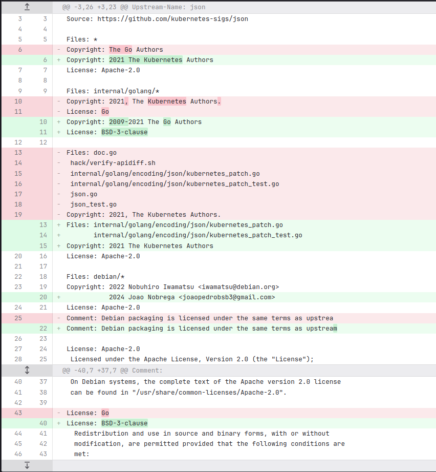

# João Pedro

### Pacote golang-k8s-apimachinery

Correções adicionais foram necessárias para esse pacote, o patch de correção dos testes em análise posterior não resolvia tão bem o problema e chegamos à conclusão de modificar o teste para pulá-lo.
Além disso, houve a necessidade de alterar o arquivo debian/copyright com atualização das licensas usadas pelo pacote ( e também corrigir um erro do mantenedor sobre o range dessas licensas).
Com isso, o pacote foi aprovado e o MR, merjado.

[Link do MR](https://salsa.debian.org/go-team/packages/golang-k8s-apimachinery/-/merge_requests/1?commit_id=4bb8331c1ccc3b179ba0fa3993acfaeeec693aea)

[Link da issue](https://salsa.debian.org/debian-brasil-team/docs/-/issues/333)

[Pacote migrado para Testing](https://tracker.debian.org/news/1591560/golang-k8s-apimachinery-0313-1-migrated-to-testing/)

### Pacote golang-k8s-sigs-json

Mais uma atualização de Upstream, seguindo a atualização de diversas dependências dos pacotes do K8s para a versão 0.31.x.
Esse pacote não possui depêndencias a serem atualizadas, diferente de diversos pacotes no monolito K8s. O trabalho de atualização nesse pacote foi simples, porém, o d/copyright estava consideravelmente desorganizado, com nomes errados de licença
e referências duplicadas nas sessões de copyrights como melhor percebido no diff abaixo:

[Link do MR](https://salsa.debian.org/go-team/packages/golang-k8s-sigs-json/-/merge_requests/1)

[Link da issue](https://salsa.debian.org/debian-brasil-team/docs/-/issues/360)

### Pacote golang-k8s-sigs-release-utils

Pacote atual que estou atualizando, o trabalho começa a ficar mais interessante, com a atualização desse pacote necessitando de pular um caso de teste que dependia de acesso à internet.
O pacote do apimachinery resolveu isso através de um patch, já esse pacote necessitou da adição de um campo adicional no arquivo debian/rules, removendo esse caso de teste antes da build do pacote.
O MR dessa atualização já foi feito, e está no processo de revisão.

[Link do MR](https://salsa.debian.org/go-team/packages/golang-k8s-sigs-release-utils/-/merge_requests/1)

[Link da issue](https://salsa.debian.org/debian-brasil-team/docs/-/issues/379)

- #### Pristine-tar

Além disso, o pacote não possui a branch pristine-tar. Essa branch abriga todos os tarballs de origem do upstream e os seus metadados do repositório git. Ela não guarda o código fonte em si, 
mas todas as informações necessárias para reconstruir o tarball do upstream de maneira compacta.
Logo, para criar essa branch, é necessário coletar todos os arquivos *.orig,tar.gz do upstream e comitá-los em ordem. Esse processo foi feito de forma remota, porém estou aguardando finalizar a atualização 
do pacote para gerar esse novo MR.

Discussão sobre a branch pristine-tar também disponível na issue desse pacote.

### Guia de uso do ratt

Durante o processo de contribuição do pacote do apimachinery, foi necessário rodar as suas dependências reversas no debian sid usando o ratt, o que para quem não está no ambiente Debian pode ser desafiador.
Então após conseguir configurar o ratt e fazer sua pinagem para não conflitar com os pacotes da distro utilizada, fiz uma contribuição à documentação da turma anterior e posteriormente pretendo adicioná-la
também à wiki do Debian Brasil, após revisá-la com o grupo.

Disponível [aqui](https://mylena-angelica.github.io/Debian-GCES-24.1/tutoriais/tutorial_ratt/)
