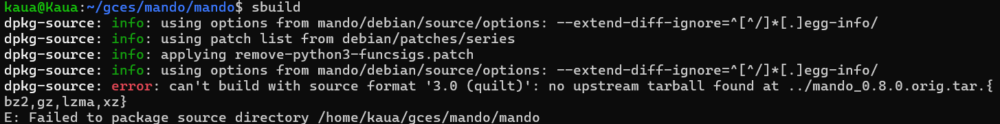

# Kauã Vinícius

## Pacote Mando

O pacote mando trata-se de um wrapper para o argparse do python, permite que o usuário escreava aplicações CLI de maneira flexível. Seu repositório no salsa esta disponível [neste link](https://salsa.debian.org/python-team/packages/mando). 

## Issue 

Objetivo: Gerar nova versão upstream para o pacote , atualizando-o para a versão indicada no [Tracker](https://tracker.debian.org/pkg/mando), entretanto, agora lidando com patches.

### Execução

Para concluir a issue, foi necessário apenas seguir os passos disponíveis no [repositório do semetre anterior da disciplina](https://mylena-angelica.github.io/Debian-GCES-24.1/tutoriais/atualizacao_upstream/) com exceção a dois passos: </br>

1 - Ao rodar sbuild, um erro descrito na imagem 1 relacionado a tarball era disparado:



Para solucionar o erro, foi necessário executar o comando:

```
gbp export-orig
```

Com isso, ele gerava corretamente a tarball e permitia a sequência do processo de empacotamento.

2 - A o rodar o segundo sbuild, vizando garantir que o pacote não quebrou durante a atualização do upstream do mesmo, ele disparava um erro relacionado a pacthes não aplicados. Todavia, o patch já havia sido sim aplicado, então, para resolver este erro, foi necessário apenas apagar a pasta debian/patches.

### Status da issue
Por conta da necessidade do pacote de atualizar 3 branches diferentes, foram abertos 3 MRs, sendo eles

1 - [Master](https://salsa.debian.org/python-team/packages/mando/-/merge_requests/5) <br/>
2 - [Upstream](https://salsa.debian.org/python-team/packages/mando/-/merge_requests/3) <br/>
3 - [Pristine-tar](https://salsa.debian.org/python-team/packages/mando/-/merge_requests/4) <br/>

Até o dia 11/12/2024 ainda estão em processo de revisão.

## Pacote Golang Barcode

O pacote Barcode permite com que o usuário crie diferentes tipos de código de barras. Seu repositório no salsa esta disponível [neste link](https://salsa.debian.org/go-team/packages/golang-barcode). 

## Issue 

Objetivo: Gerar nova versão upstream para o pacote , atualizando-o para a versão indicada no [Tracker](https://tracker.debian.org/pkg/golang-barcode).

### Execução

Para concluir a issue, foi necessário apenas seguir os passos disponíveis no [repositório do semetre anterior da disciplina](https://mylena-angelica.github.io/Debian-GCES-24.1/tutoriais/atualizacao_upstream/).

### Status da issue
Foi aberto apenas um MR. Até o dia 11/12/2024 ainda estão em processo de revisão.

## Pacote Golang a8m-tree

O pacote a8m-tree é a implementação do comando "tree" mas escrito na linguagem Golang. Seu repositório no salsa esta disponível [neste link](https://salsa.debian.org/go-team/packages/golang-github-a8m-tree). 

## Issue 

Objetivo: Gerar nova versão upstream para o pacote , atualizando-o para a versão indicada no [Tracker](https://tracker.debian.org/pkg/golang-github-a8m-tree).

### Execução

Para concluir a issue, foi necessário apenas seguir os passos disponíveis no [repositório do semetre anterior da disciplina](https://mylena-angelica.github.io/Debian-GCES-24.1/tutoriais/atualizacao_upstream/).

### Status da issue
Foi aberto apenas um MR. Até o dia 11/12/2024 ainda estão em processo de revisão.

## Versão

| Versão |    Data    |         Descrição          |  Autor(es)  |
| :----: | :--------: | :------------------------: | :---------: |
| `1.0`  | 03/11/2024 | Criação de documento e atualização do status do pacote| Kauã |
| `1.1`  | 11/12/2024 | Adição de informações      | Kauã|
