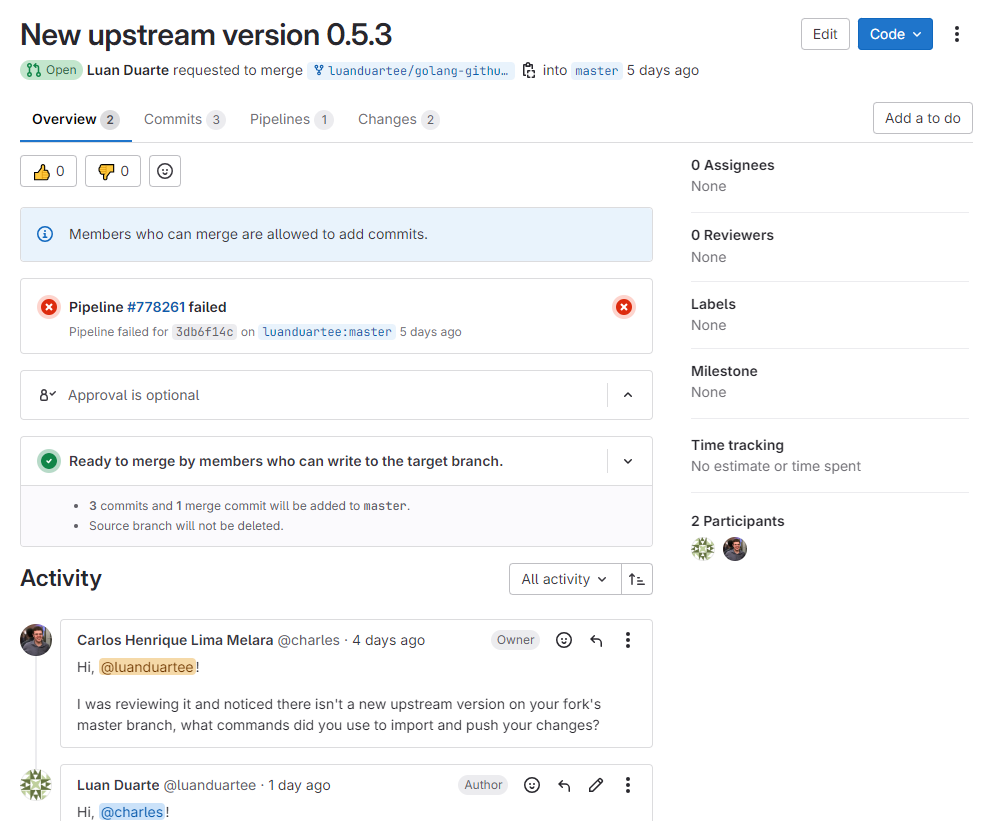

# Luan Mateus - Sprint 2

## Pacotes da Sprint 2
### 1. golang-github-adrg-xdg
- Descrição: Uma biblioteca escrita em Go que implementa os padrões de diretórios base definidos pela Especificação XDG. Essa especificação é usada para organizar arquivos de configuração, dados de usuário e caches de aplicativos.
- Status (11/12/2024 às 22h53): **Review**
- Tipo: Atualização da versão upstream
- Issue [#318](https://salsa.debian.org/debian-brasil-team/docs/-/issues/318)
- [Merge Request](https://salsa.debian.org/go-team/packages/golang-github-adrg-xdg/-/merge_requests/5)

### 2. python-rosettasciio
- Descrição: É uma biblioteca Python voltada para leitura e escrita de dados em diversos formatos científicos, fornecendo uma interface unificada para lidar com datasets, seus eixos e metadados relacionados. Basicamente, traduz as informações de arquivos em dicionários Python, permitindo fácil manipulação e integração com outras bibliotecas de análise de dados.
- Status (11/12/2024 às 22h58): **Closed**
- Tipo: Atualização da versão upstream
- Não foi possível fazer a atualização de upstream do pacote pois o mesmo já tinha sido atualizado pelo mantenedor, porém a issue estava como status "Open" quando foi selecionado para atualizar. Portanto, já tinha sido resolvido.
- Issue [#286](https://salsa.debian.org/debian-brasil-team/docs/-/issues/286)

| Versão |    Data    |      Descrição       |                   Autor(es)                   |
| :----: | :--------: | :------------------: | :-------------------------------------------: |
| `1.0`  | 12/12/2024 | Criação do documento | [Luan Mateus](https://github.com/luanduartee) |