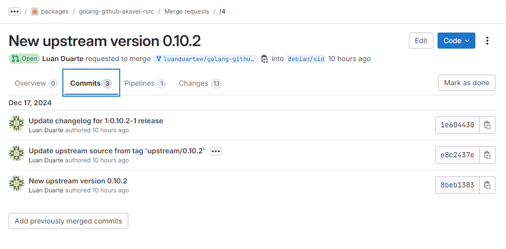

# Luan Mateus - Sprint 2

## Pacotes da Sprint 2
### 1. golang-github-adrg-xdg
- **Descrição**: Uma biblioteca escrita em Go que implementa os padrões de diretórios base definidos pela Especificação XDG. Essa especificação é usada para organizar arquivos de configuração, dados de usuário e caches de aplicativos.
- **Status** (12/12/2024 às 09h33): Doing
- **Tipo**: Atualização da versão upstream
- **Issue** [#318](https://salsa.debian.org/debian-brasil-team/docs/-/issues/318)
- [Merge Request](https://salsa.debian.org/go-team/packages/golang-github-adrg-xdg/-/merge_requests/5)
- **Considerações**: O pacote estava com um problema de dependências e conflitos para construção nas diferentes branchs, um solução foi apresentada no Merge Request. Porém, houve um retorno para realizar algumas alterações.

### 2. golang-github-akavel-rsrc
- **Descrição**: Útil para criar ícones, manifestos e outros recursos a programas escritos em Go que serão executados no Windows.
- **Status** (16/12/2024 às 22h25): Review
- **Tipo**: Atualização da versão upstream
- **Issue** [#327](https://salsa.debian.org/debian-brasil-team/docs/-/issues/327)
- [Merge Request](https://salsa.debian.org/go-team/packages/golang-github-akavel-rsrc/-/merge_requests/4)

### 3. python-rosettasciio
- **Descrição**: É uma biblioteca Python voltada para leitura e escrita de dados em diversos formatos científicos, fornecendo uma interface unificada para lidar com datasets, seus eixos e metadados relacionados. Basicamente, traduz as informações de arquivos em dicionários Python, permitindo fácil manipulação e integração com outras bibliotecas de análise de dados.
- **Status** (11/12/2024 às 22h58): Closed
- **Tipo**: Atualização da versão upstream
- **Issue** [#286](https://salsa.debian.org/debian-brasil-team/docs/-/issues/286)
- **Considerações**: Não foi possível fazer a atualização de upstream do pacote pois o mesmo já tinha sido atualizado pelo mantenedor, porém a issue estava como status "Open" quando foi selecionado para atualizar. Portanto, já tinha sido resolvido.

| Versão |    Data    |      Descrição       |                   Autor(es)                   |
| :----: | :--------: | :------------------: | :-------------------------------------------: |
| `1.0`  | 12/12/2024 | Criação do documento | [Luan Mateus](https://github.com/luanduartee) |
| `2.0`  | 12/12/2024 | Atualização do documento | [Luan Mateus](https://github.com/luanduartee) |