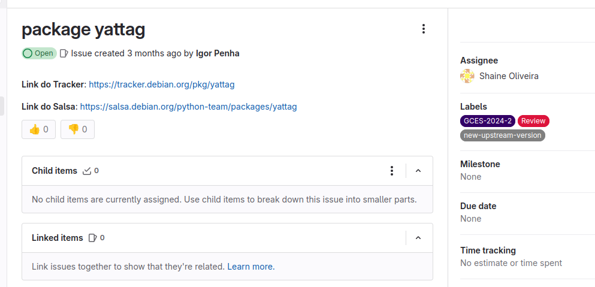
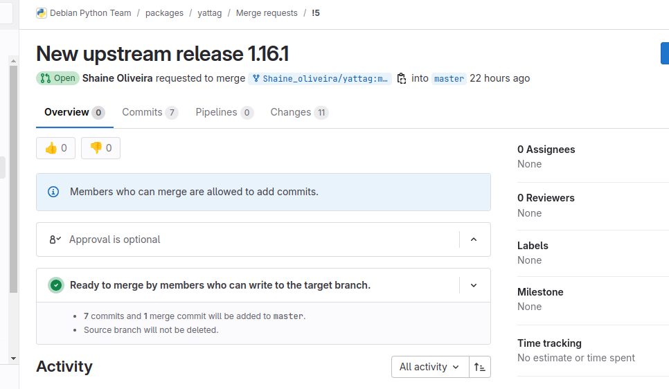
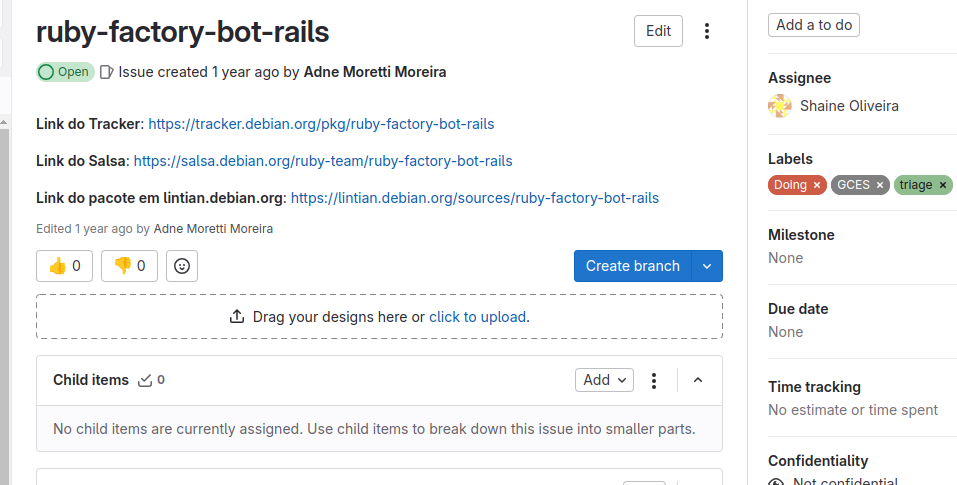
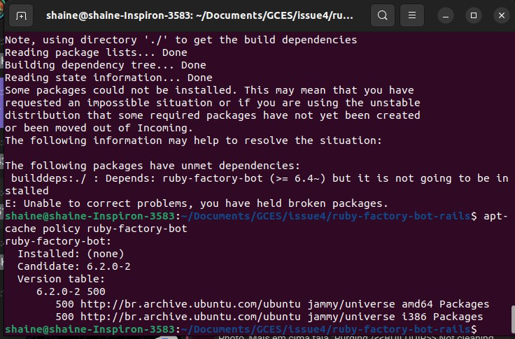
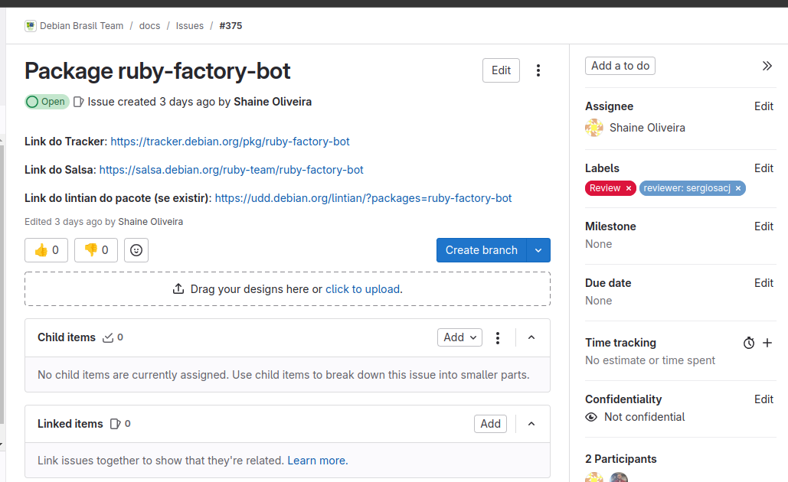

# Shaíne Oliveira

## Issue package yattag #308

### Sobre o pacote
O Yattag pode preencher seus formulários HTML com valores padrão e mensagens de erro. Passe um dicionário defaults de valores padrão e um dicionário errors de mensagens de erro para o construtor Doc. Então, use os métodos especiais input, textarea, select, option ao gerar seus documentos.

### Status da issue

- MR

- Após review da issue, foi adicionado um comentário que o pacote já estava na sua atualização mais recente e não "valia a pena" carregar o pacote apenas para atualizar a versão do Standards.

"Olá @Shaine_oliveira, infelizmente outra pessoa já fez as mesmas alterações que você e carregou o pacote no mês passado.
Se você abrir o yattag no tracker, verá que o upstream já está na versão mais recente. A versão Standards do pacote ainda está desatualizada, mas não vale a pena carregar o pacote apenas para esta única alteração.
Uma coisa que você pode fazer é atualizar o repositório git, já que o upload mais recente não foi incluído lá [...]."

## Issue ruby-factory-bot-rails #119

## Sobre o pacote
O FactoryBot é uma ferramenta muito utilizada em desenvolvimento de projetos Ruby on Rails por permitir prototipar com facilidade instâncias de models da sua aplicação dentro do ambiente de testes. Além de poder ser utilizado para popular seu banco de dados, podemos criar objetos não salvos e atributos para models usando os métodos build e attributes_for. 

## Status da Issue
 Após importar a nova versão upstream, o build apresentou erro ao construir o pacote novamente.

 

 No entanto, foi abordado na reunião semanal do Debian que o pacote [ruby-factory-bot](https://tracker.debian.org/pkg/ruby-factory-bot) estava desatualizado e necessitaria atualizá-lo antes de dar continuidade na issue. Dessa forma, eu criei a issue para prosseguir com o prosseguimento que já está em "Review".

 - Issue #375

 

| Versão |    Data    |         Descrição          |  Autor(es)  |
| :----: | :--------: | :------------------------: | :---------: |
| `1.0`  | 11/12/2024 | Criação de documento | [Shaíne Oliveira](https://github.com/ShaineOliveira) |
| `1.1`  | 16/12/2024 | Atualiza status da issues | [Shaíne Oliveira](https://github.com/ShaineOliveira) |