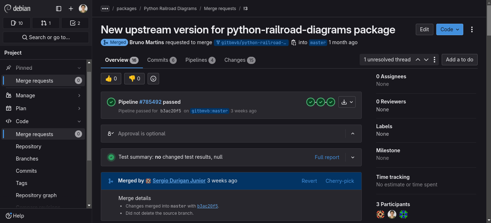
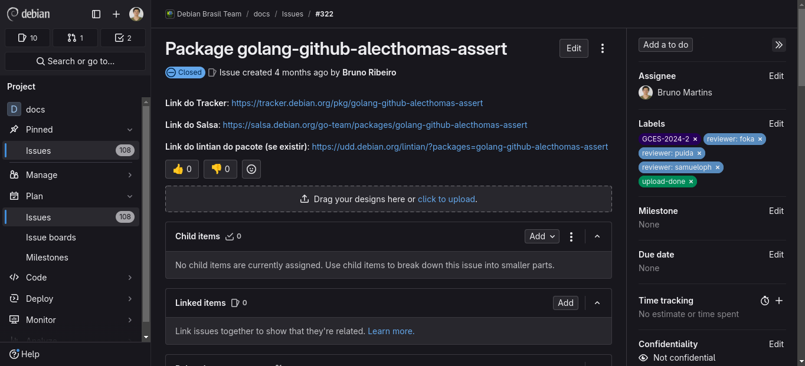
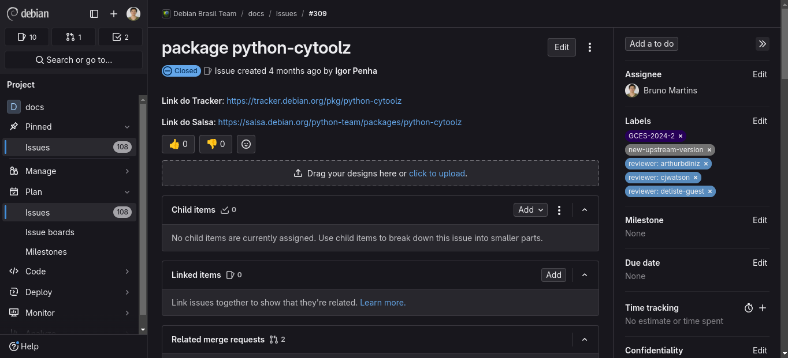
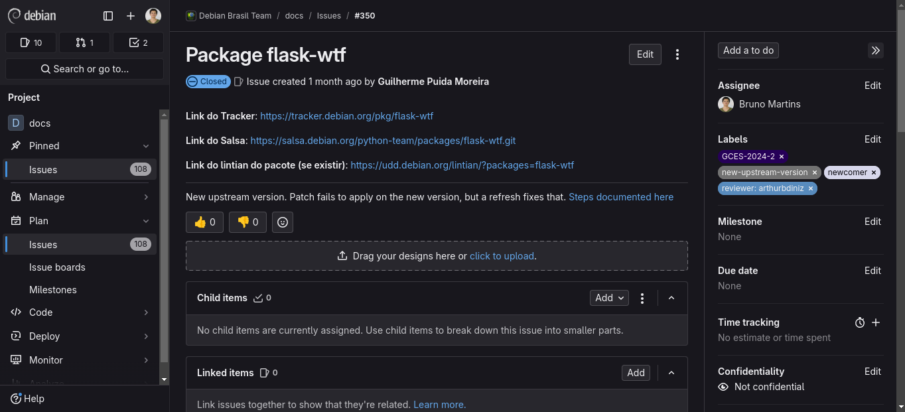
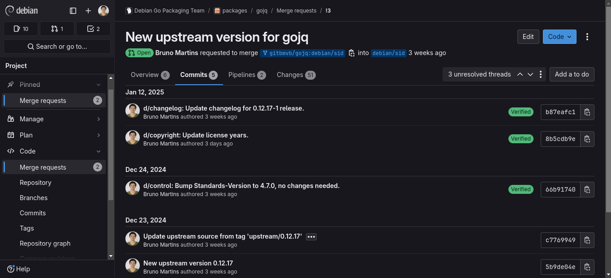
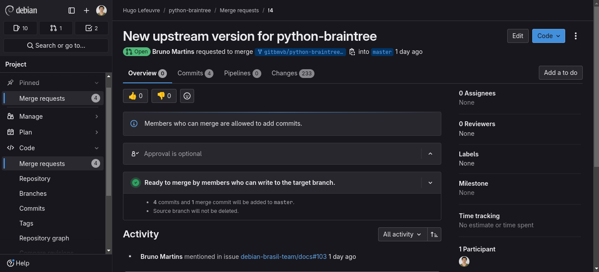
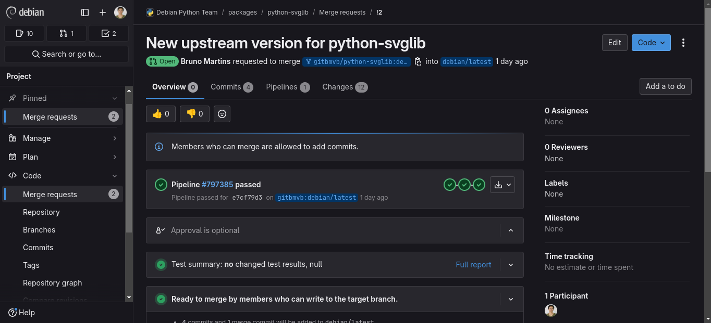
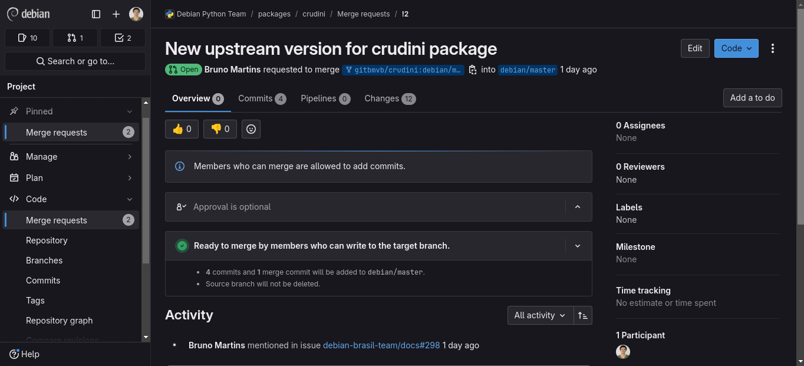

# Bruno Martins - Sprint 3
O meu trabalho na terceira entrega concentrou-se em

- Consertar pacotes que passaram por revisão nas sprints anteriores;
- Atualizar a versão mainstream de pacotes novos;
- Contribuir com a documentação.

Vale ressaltar que em razão das festas de fim de ano, a maioria dos merge requests receberam uma revisão somente após o Ano Novo, impedindo, assim, que eu pudesse me dedicar a uma quantidade maior de pacotes na sprint atual.

## Atualizações

### 1. python-railroad-diagrams
- Descrição: This is a small library for generating railroad diagrams (like what JSON.org uses) using SVG, with both JS and Python ports. Railroad diagrams are a way of visually representing a grammar in a form that is more readable than using regular expressions or BNF. They can easily represent any context-free grammar, and some more powerful grammars. There are several railroad-diagram generators out there, but none of them had the visual appeal I wanted, so I wrote my own.

- Status (15/01/2025 às 19h49): **Merged**
- Tipo: Atualização da versão upstream
- Revisor: [Sérgio Durigan Jr](https://salsa.debian.org/sergiodj)
- Issue [#313](https://salsa.debian.org/debian-brasil-team/docs/-/issues/313)
- [Merge Request](https://salsa.debian.org/python-team/packages/python-railroad-diagrams/-/merge_requests/3)

### 2. golang-github-alecthomas-assert
- Descrição:  
- Status (15/01/2025 às 19h49): **Closed**
- Tipo: Atualização da versão upstream
- Revisores: Guilherme Puida
- Issue [#322](https://salsa.debian.org/debian-brasil-team/docs/-/issues/322)
- [Merge Request](https://salsa.debian.org/go-team/packages/golang-github-alecthomas-assert/-/merge_requests/3)
- Comentários: Já havia outro MR para este pacote, porém não estava associado à issue. Por este motivo, foi dada preferência a este MR, por ter sido enviado primeiro. Assim, a issue foi finalizada, mas minha contribuição foi feita.

### 3. python-cytoolz
- Descrição: Cython implementation of the toolz package, which provides high performance utility functions for iterables, functions, and dictionaries. "toolz" is a pure Python package that borrows heavily from contemporary functional languanges.  It is designed to interoperate seamlessly with other libraries including itertools, functools, and third party libraries. High performance functional data analysis is possible with builtin types like list and dict, and user-defined data structures; and low memory usage is achieved by using the iterator protocol and returning iterators whenever possible.

- Status (15/01/2025 às 19h49): **Closed**
- Tipo: Atualização da versão upstream
- Revisores: Guilherme Puida e Arthur Diniz
- Issue [#309](https://salsa.debian.org/debian-brasil-team/docs/-/issues/309)
- Comentários: O pacote estava pronto, mas a issue não foi fechada.

### 4. flask-wtf
- Descrição: pacote python que busca integrar as bibliotecas Flask and WTForms.

- Status (15/01/2025 às 19h49): **Closed**
- Tipo: Atualização da versão upstream
- Revisores: Arthur Diniz
- Issue [#350](https://salsa.debian.org/debian-brasil-team/docs/-/issues/350)
- Comentários: Mesmo motivo do item 2.

**Obs.:** Os pacotes pyenchant, pyvirtualdisplay e jqp continuam em revisão (Ver sprint anterior).

## Pacotes da Sprint 3

### 1. gojq
- Descrição: This is an implementation of jq command written in Go language. You can also embed gojq as a library to your Go products.
- Status (15/01/2025 às 19h49): **Review**
- Tipo: Atualização da versão upstream
- Revisores: Carlos Henrique Lima Melara
- Issue [#320](https://salsa.debian.org/debian-brasil-team/docs/-/issues/320)
- [Merge Request](https://salsa.debian.org/go-team/packages/gojq/-/merge_requests/3)

### 2. python3-braintree
- Descrição: This is an implementation of jq command written in Go language. You can also embed gojq as a library to your Go products.
- Status (15/01/2025 às 19h49): **Review**
- Tipo: Atualização da versão upstream
- Revisores: Samuel Henrique
- Issue [#103](https://salsa.debian.org/debian-brasil-team/docs/-/issues/103)
- [Merge Request](https://salsa.debian.org/hle/python-braintree/-/merge_requests/4)

### 3. python3-svglib
- Descrição: Svglib is a pure-Python library for reading SVG files and converting them (to a reasonable degree) to other formats using the ReportLab Open Source toolkit. Used as a package you can read existing SVG files and convert them into ReportLab Drawing objects that can be used in a variety of contexts, e.g. as ReportLab Platypus Flowable objects or in RML. As a command-line tool it converts SVG files into PDF ones (but adding other output formats like bitmap or EPS is really easy and will be better supported, soon).
- Status (15/01/2025 às 19h49): **Review**
- Tipo: Atualização da versão upstream
- Revisores: Samuel Henrique
- Issue [#324](https://salsa.debian.org/debian-brasil-team/docs/-/issues/324)
- [Merge Request](https://salsa.debian.org/hle/python-braintree/-/merge_requests/4)

### 4. crudini
- Descrição: 
- Status (15/01/2025 às 19h49): **Review**
- Tipo: Atualização da versão upstream
- Revisores: Samuel Henrique, Guilherme Puida ou Sérgio Durigan Jr.
- Issue [#298](https://salsa.debian.org/debian-brasil-team/docs/-/issues/298
)
- [Merge Request](https://salsa.debian.org/python-team/packages/crudini/-/merge_requests/2)

## Outras Contribuições

| Versão |    Data    |      Descrição       |                   Autor(es)                   |
| :----: | :--------: | :------------------: | :-------------------------------------------: |
| `1.0`  | 15/01/2025 | Criação do documento | [Bruno Martins](https://github.com/gitbmvb) |