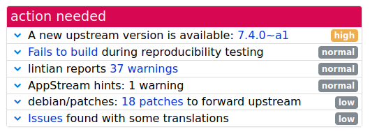
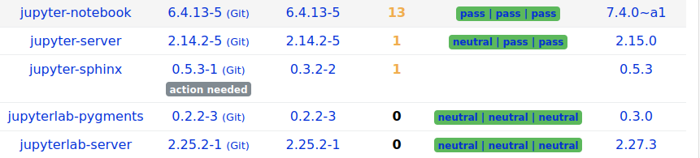
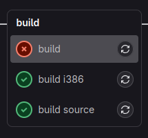

# Douglas Alves

## Sprints Anteriores

### Pacote python-wcmatch

O pacote trabalhado com a [Geovanna](https://github.com/manuziny) teve seu MR aceito.


### Pacote jupyter-notebook

O desafio de atualização desse pacote é considerável.



Além das mudanças significativas no código, ele também depende de outros
pacotes do ecossistema Jupyter que precisariam ter sua versão atualizada.
Dito isso, uma abordagem mais tranquila pode ser a de atualizar os outros pacotes do jupyter primeiramente e depois partir para o desafio maior.



### Pacote python-matplotlib-venn

Na sprint anterior, esse pacote estava dando erro de build na máquina do reviewer e na CI do Salsa. Então fui investigar mais a fundo para encontrar o culpado. Após um tempo, cheguei ao seguinte teste:

```python
>>> alg = LayoutAlgorithm()
>>> layout = alg((1,1,1,1,1,1,1), ("A", "B", "C"))
>>> layout.centers
[Point2D(-0.13..., 0.07...), Point2D(0.13..., 0.077...), Point2D(-1..., -0.15...)]
>>> layout.radii
[0.42..., 0.42..., 0.42...]
```

Contudo, havia um problema: o dito teste estava passando com sucesso na minha build local (?). Minha primeira suposição foi que o problema fosse devido à discrepância de versões de alguma das dependências (como numpy ou scipy), porém, acabei por concluir que esse não fosse o caso. As versões das depêndencias eram todas as mesmas e, mesmo criando um ambiente virtual do zero para rodar o teste localmente, ele continuava passando com sucesso, diferentemente do que acontecia na build da CI do Salsa.

Observando melhor as pipelines do Salsa reparei uma coisa interessante: apesar da build padrão (AMD64) falhar, a build i386 estava passando com sucesso. Enquanto a primeira é uma arquitetura de 64 bits, a segunda é de 32 bits. Logo, o problema poderia ser causado por questões de precisão de ponto flutuante.



Ao invés de comparar os floats dos testes com métodos mais apropriados para esse tipo, o autor da lib simplesmente usou a reticências dos doctests, o que não é muito confiável, visto que ela simplesmente dá match com qualquer valor. Segue exemplo:

```python
0.42... == 0.42
0.42... == 0.42222
0.42... == 0.429
0.42... == 0.42a
```

Para praticamente todos os testes, isso não se apresentou como um problema, com exceção de um em específico: o que estava falhando a build no Salsa. O motivo? Enquanto todos os outros casos faziam asserções com valores com representação de ponto flutuante decimal (0.1, 0.42, -0.13), esse em particular apresentava um dos seus pontos com a coordenada x muito pequena, logo o python o representava em notação científica (-1.66e-06). Como a asserção era feita apenas com o primeiro dígito (-1...), a precisão necessária nesse caso de teste em específico era bem maior do que a dos outros.

Sendo assim, rodei esse teste em outras máquinas para verificar a variabilidade dos valores retornados nesse caso. Um dos exemplos:

```python
[Point2D(-0.13366198151557587, 0.07712719614271278), 
 Point2D(0.1336645419846076, 0.07713029030107096), 
 Point2D(-2.422870463295673e-06, -0.15425731751492133)]`
```

Após essas verificações, concluí que muito provavelmente o autor da lib não tinha contado com isso, então fiz um patch que desativava esse caso de teste em específico.

#### Status da issue

Após a mudanças descritas anteriormente, estou com a revisão do [MR](https://salsa.debian.org/python-team/packages/python-matplotlib-venn/-/merge_requests/1) pendente até a presente data de 16/01/2025

## Sprint Atual

### Pacote faker

O faker ([repo no salsa](https://salsa.debian.org/python-team/packages/faker)) é um pacote python que gera dados falsos para você. Seja para inicializar um banco de dados, criar documentos XML atraentes visualmente ou anonimizar dados extraídos de um serviço em produção.

### Issue: [#400](https://salsa.debian.org/debian-brasil-team/docs/-/issues/400)

Para a escolha do pacote, foi observada sua página no tracker:

* [Link do Tracker](https://tracker.debian.org/pkg/faker)
 
#### Execução

A atualização do pacote se apresentou bem simples, não sendo necessário verificar muitas coisas além do básico:

#### Status da issue

Um [MR](https://salsa.debian.org/python-team/packages/faker/-/merge_requests/4) foi criado e começou a ser revisado pelo reviwer Sergio Durigan Junior. Em 16/01/2025, o MR ainda está em revisão.

## Histórico de Versão

| Versão |    Data    |         Descrição          |  Autor(es)  |
| :----: | :--------: | :------------------------: | :---------: |
| `1.0`  | 16/01/2025 | Criação do documento | [Douglas Alves](https://github.com/dougAlvs) |

