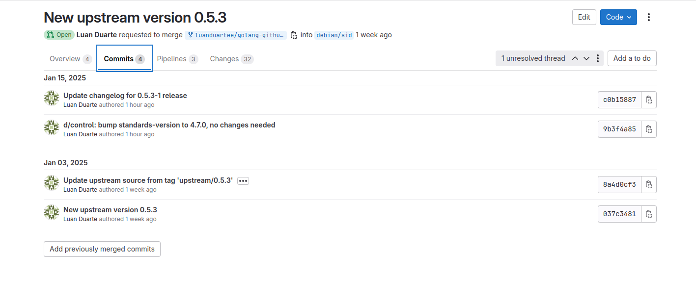
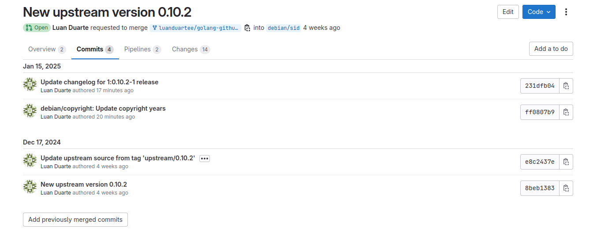
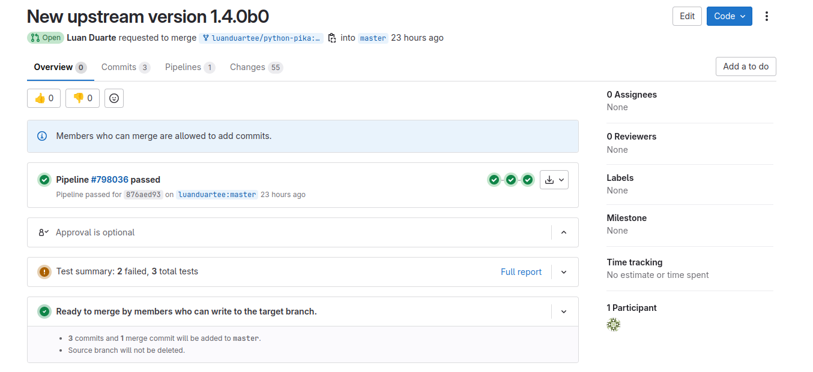

# Luan Mateus - Sprint 3

## Atualizações de Pacotes da Sprint 2

### 1. golang-github-adrg-xdg
- **Descrição**: Uma biblioteca escrita em Go que implementa os padrões de diretórios base definidos pela Especificação XDG. Essa especificação é usada para organizar arquivos de configuração, dados de usuário e caches de aplicativos.
- **Status** (14/01/2025 às 21h44): Review
- **Tipo**: Atualização da versão upstream
- **Issue** [#318](https://salsa.debian.org/debian-brasil-team/docs/-/issues/318)
- [Merge Request](https://salsa.debian.org/go-team/packages/golang-github-adrg-xdg/-/merge_requests/6)
- **Considerações**: O pacote estava com problema na definição da branch principal. Após fazer as devidas correções e a criação de um novo Merge Request, foi solicitado a modificação do arquivo debian/control para atualização do Standards-Version.

### 2. golang-github-akavel-rsrc
- **Descrição**: Útil para criar ícones, manifestos e outros recursos a programas escritos em Go que serão executados no Windows.
- **Status** (15/01/2025 às 20h47): Review
- **Tipo**: Atualização da versão upstream
- **Issue** [#327](https://salsa.debian.org/debian-brasil-team/docs/-/issues/327)
- [Merge Request](https://salsa.debian.org/go-team/packages/golang-github-akavel-rsrc/-/merge_requests/4)
- **Considerações**: Foi solicitado a atualização da versão anual de copyright depois do MR ter sido solicitado. Com isso, as alterações foram feitas e o MR foi atualizado.

## Pacotes da Sprint 3

### 1. python-pika
- **Status** (14/01/2025 às 21h31): Review
- **Tipo**: Atualização da versão upstream
- **Issue** [#288](https://salsa.debian.org/debian-brasil-team/docs/-/issues/288)
- [Merge Request](https://salsa.debian.org/python-team/packages/python-pika/-/merge_requests/4)
- **Considerações**: A atualização da nova versão de upstream foi concluída com sucesso e o MR passou pela verificação pipeline. Com isso, o MR está na fila para ser revisado.

| Versão |    Data    |      Descrição       |                   Autor(es)                   |
| :----: | :--------: | :------------------: | :-------------------------------------------: |
| `1.0`  | 15/01/2025 | Criação do documento | [Luan Mateus](https://github.com/luanduartee) |