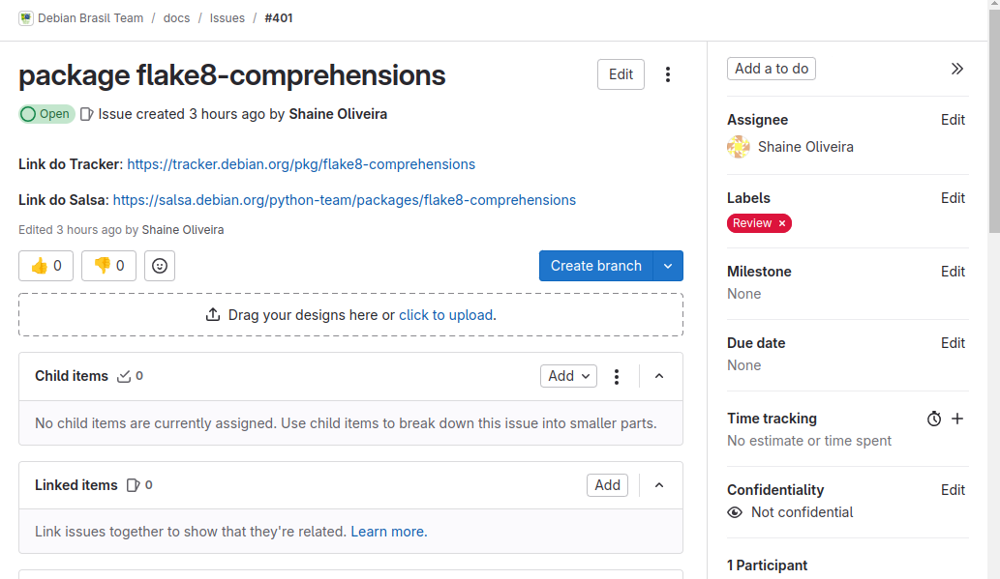

# Shaíne Oliveira

## Issue ruby-factory-bot #375

## Status da Issue
 Foi importado a nova upstream, mas houve um comentário para retirar uma patch do pacote:

 "Hi @Shaine_oliveira,
I see that @sergiosacj already did a good review (thanks!).
There's one small thing that I noticed and that might be worth looking into.  This package carries a patch (0005-skip-failing-test.patch) whose purpose is to disable a test that was failing.  The patch seems to have been created back in 2023, and I believe it's not needed anymore (I tried removing it, and the package still built fine).
Would you like to take a look and see if you can remove it, please?  Once you do it, I can sponsor the upload for you.
Thanks."

 

 - Ainda estou tentando retirar essa patch sem erro.

## Issue package flake8-comprehensions #401

 

- Review

| Versão |    Data    |         Descrição          |  Autor(es)  |
| :----: | :--------: | :------------------------: | :---------: |
| `1.0`  | 11/12/2024 | Criação de documento | [Shaíne Oliveira](https://github.com/ShaineOliveira) |
| `1.1`  | 16/12/2024 | Atualiza status da issues | [Shaíne Oliveira](https://github.com/ShaineOliveira) |
| `1.2`  | 14/01/2025 | Atualiza status da issues | [Shaíne Oliveira](https://github.com/ShaineOliveira) |
