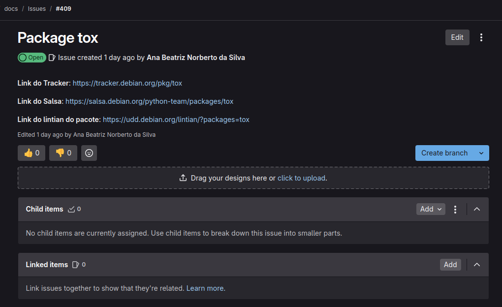
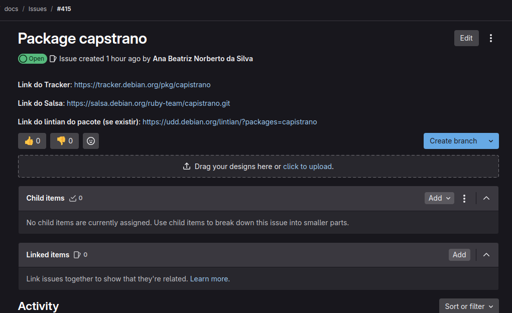

# Sprint 4


## Issue da sprint 3: Package jupyter-cache (#402)

### Esse pacote ainda esta esperando para ser aprovado


- **Status**: esperando aprovação
- **Links**:
  - [Tracker Debian](https://tracker.debian.org/pkg/jupyter-cache)
  - [Repositório Salsa](https://salsa.debian.org/python-team/packages/jupyter-cache)
  - [Link do MR](https://salsa.debian.org/python-team/packages/jupyter-cache/-/merge_requests/1)


# Issues Sprint 4: Package tox (#409)

### Sobre este pacote

O Tox é uma ferramenta de automação para testar pacotes Python em diferentes ambientes e versões, garantindo compatibilidade e facilitando a integração contínua.




- **Status**: esperando aprovação
- **Links**:
  - [Tracker Debian](https://tracker.debian.org/pkg/tox)
  - [Repositório Salsa](https://salsa.debian.org/python-team/packages/tox)


### Problemas enfrentados


- problema similar ao do packege capstrano

```ini
dpkg-source: info: Hint: make sure the version in debian/changelog matches the unpacked source tree
dpkg-source: info: you can integrate the local changes with dpkg-source --commit
dpkg-source: error: aborting due to unexpected upstream changes, see /tmp/capstrano_4.23.0-2.diff.U2_SvX
E: Failed to package source directory /home/ana/Debian/capstrano/capstrano
gbp:error: 'sbuild' failed: it exited with 1

```
Após ter esse problema eu passei para o **Package capstrano (#415)** onde foi possivel corrigir o erro e buildar 
o pacote  mas não foi possivel fazer o mesmo com o **Package tox (#409)** mesmo fazendo o mesmo passo a passo o erro da imagem 1 persistiu.


# Issues Sprint 4: Package capstrano (#415)

### Sobre este pacote

Capistrano é uma ferramenta de automação de deploy baseada em Ruby 
que usa SSH para executar comandos remotamente, facilitando a implantação de aplicações.



- **Status**: esperando aprovação
- **Links**:
  - [Tracker Debian](https://tracker.debian.org/pkg/capstrano)
  - [Repositório Salsa](https://salsa.debian.org/python-team/packages/capstrano)


### Problemas enfrentados

Durante o processo de build do pacote houve alguns problemas com patches e com o litian.

1 - dpkg-source 

```ini
dpkg-source: info: Hint: make sure the version in debian/changelog matches the unpacked source tree
dpkg-source: info: you can integrate the local changes with dpkg-source --commit
dpkg-source: error: aborting due to unexpected upstream changes, see /tmp/capstrano_4.23.0-2.diff.U2_SvX
E: Failed to package source directory /home/ana/Debian/capstrano/capstrano
gbp:error: 'sbuild' failed: it exited with 1

```

2 - Foi criado um pach com o `dpkg-source --commit` para tentar resolver o problema

3 - Changelog foi alterado

4 - Comando `gbp buildpackage` novamente

5 - Problema no litian similar ao da sprint passada

6 - Alterei o git log para corrigir o erro do litian e dei um `git commit --amend`

## Observação

Como nunca tinha mexido com patches antes enviei uma mensagem para o puida para saber se era correto fazer aquilo pois não foi encontrado nada na wiki do debian.
Aguardando retorno.

O erro ocorreu porque o arquivo debian/changelog estava configurado para a distribuição errada. Após alterar de `mantic` para `unstable`, o build passou a funcionar corretamente.


## Depois de ser enviado para revisão

 (Após tirar a dúvida em relação aos patches subirei o MR)
[Link do MR]() (em breve..)


## Histórico de Versões

| Versão | Data | Descrição | Autor(es) |
| :----: | :--------: | :------------------: | :-------------------------------------------: |
| `1.0`  | 30/01/2025  | Criação do documento | [Ana Beatriz](https://github.com/ananorberto) |
