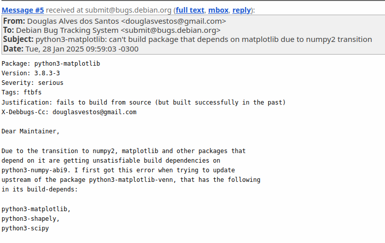

# Douglas Alves

## Sprints Anteriores

### Pacote python-matplotlib-venn

Na sprint anterior, eu havia identificado um bug em um dos testes da biblioteca: 

Devido a forma que números de ponto flutuante são representados, operações entre eles podem propagar erros. Sendo assim, certos cuidados devem ser tomados para comparar esses números. No teste em questão, o método utilizado não era muito confiável, logo o resultado do teste variava de ambiente para ambiente.

Primeiramente, após orientação dos revisores, eu reportei esse bug para o repositório upstream:

Até o dia em que esse documento foi escrito (30/01/2025), nenhum dos desenvolvedores da biblioteca viu a issue ainda.

Após reportar o bug, me concentrei em criar um patch que mudasse a maneira que o teste era executado e removesse a imprevisibilidade presente. Dito isso, utilizei o método `np.allclose` para fazer essa comparação de forma segura com uma precisão fixa.

Então, testei esse novo método, criei o patch e me preparei para enviar o código para revisão. Porém, antes, fui testar a build localmente, e, para minha surpresa, ela não estava passando. Dessa vez, o problema não foi na etapa de teste do pacote, mas logo no ínicio, na hora de baixar as dependências necessárias.

Ao analisar melhor o log, verifiquei que o problema estava na hora de baixar o `matplotlib`, umas das dependências principais do pacote. O sistema não estava conseguindo satisfazer a dependência `python3-numpy-abi9` do `matplotlib`.

Indo atrás da dependência em questão, descobri que ela era um "pacote virtual" do numpy e que aparentemente o problema tinha algo a ver com a transição para a versão do numpy 2 que estava ocorrendo.

Então, usando a ferramenta `reportbug` eu reportei esse bug para o Debian:

Algum tempo depois eu recebi uma resposta: apesar de ser relacionado à transição ao numpy 2, o problema era causado devido a um loop nas dependências do `matplotlib` com `pandas`. Esse loop havia sido reportado em outro bug no dia anterior, e logo foi resolvido.

Sendo assim, finalmente a build do pacote passou a funcionar novamente, e, com o novo patch que fiz nos doctests, a build estava funcionando tanto localmente, quanto no CI do Salsa.

#### Status da issue

Agora creio que minhas aventuras com esse pacote estejam chegando ao fim. Estou esperando que as últimas mudanças no [MR](https://salsa.debian.org/python-team/packages/python-matplotlib-venn/-/merge_requests/1) sejam revisadas.

### Pacote faker

O reviewer Sergio deixou alguns comentários no [MR](https://salsa.debian.org/python-team/packages/faker/-/merge_requests/4), mas já resolvi as questões pendentes. Agora estou esperando uma outra revisão por parte dele.

## Sprint Atual

### Pacote python-milc

O MILC  ([repo no salsa](https://salsa.debian.org/python-team/packages/python-milc)) é um framework para escrever aplicações CLI com Python 3.7+. Algumas de suas funcionalidades são:

* Parsing de argumentos da CLI, com ou sem subcomandos;
* Suporte automático para tab-completion;
* Suporte a cores ANSI.

### Issue: [#416](https://salsa.debian.org/debian-brasil-team/docs/-/issues/416)

Para a escolha do pacote, foi observada sua página no tracker:

* [Link do Tracker](https://tracker.debian.org/pkg/python-milc)
 
#### Execução

Além do processo de atualização do pacote em si, foi necessário atualizar um dos patches:

* d/p/remove-appdirs.patch: Remove obsolete patch.

#### Status da issue

Um [MR](https://salsa.debian.org/python-team/packages/python-milc/-/merge_requests/1) foi criado. Em 30/01/2025, o MR ainda está em revisão.

## Histórico de Versão

| Versão |    Data    |         Descrição          |  Autor(es)  |
| :----: | :--------: | :------------------------: | :---------: |
| `1.0`  | 30/01/2025 | Criação do documento | [Douglas Alves](https://github.com/dougAlvs) |

