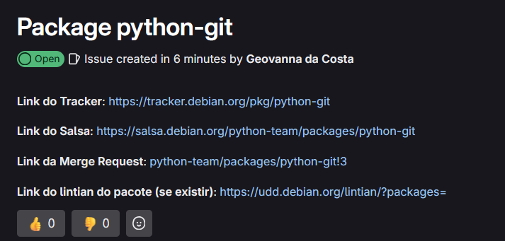
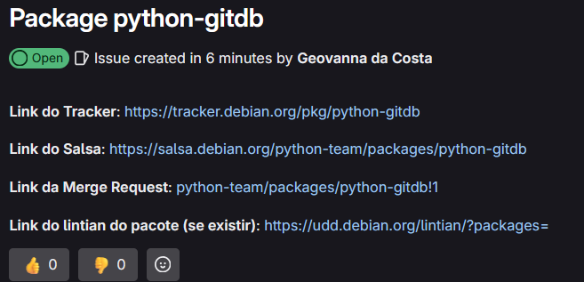
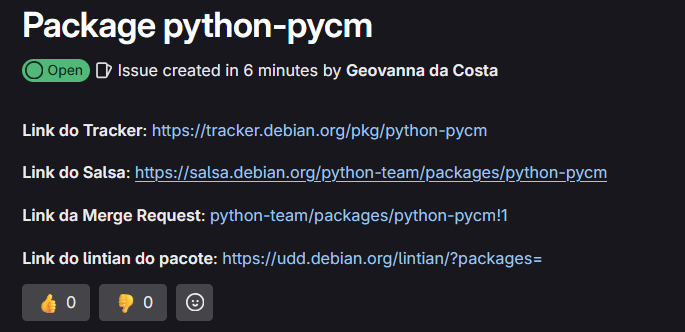
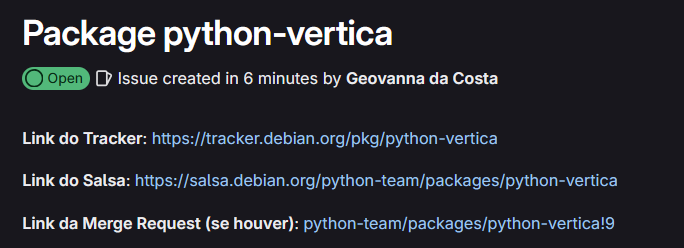
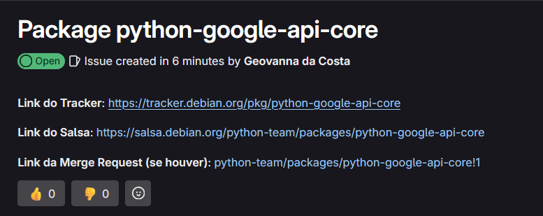

# Geovanna Maciel

## Atualização mautrix-python
Como solicitado pelo revisor, atualizei o arquivo debian/control colocando a versão correta da Standards-Version que foi atualizada. Na última sprint ela estava desatualizada, agora só falta o retorno do revisor e autorização do merge.

## GitPython
E uma biblioteca Python usada para interagir com repositórios Git, tanto em um nível alto, como o git-porcelain, quanto em um nível baixo, como o git-plumbing. Ela fornece abstrações dos objetos do Git para facilitar o acesso aos dados do repositório, muitas vezes utilizando chamadas ao programa de linha de comando do Git.

* MR : [python-team/packages/python-git!3](python-team/packages/python-git!3)
* Repositório no Salsa : [https://salsa.debian.org/python-team/packages/python-git](https://salsa.debian.org/python-team/packages/python-git)

## GitDB
Permite o acesso a repositórios Git Bare para leitura e escrita. Seu objetivo é fornecer acesso completo a objetos soltos, bem como a pacotes, com foco em desempenho e escalabilidade. Ele opera exclusivamente em fluxos, permitindo o manuseio de objetos grandes com um baixo consumo de memória.

* MR : [https://salsa.debian.org/debian-brasil-team/docs/-/issues/411](https://salsa.debian.org/debian-brasil-team/docs/-/issues/411)
* Repositório no Salsa : [https://salsa.debian.org/python-team/packages/python-gitdb](https://salsa.debian.org/python-team/packages/python-gitdb)

## PyCM
PyCM é uma biblioteca Python para matrizes de confusão multiclasse, suportando vetores de entrada e matrizes diretas. Ideal para a avaliação pós-classificação de modelos, oferece diversas métricas para cientistas de dados analisarem classificadores com precisão.

* MR : [https://salsa.debian.org/python-team/packages/python-pycm/-/merge_requests/1](https://salsa.debian.org/python-team/packages/python-pycm/-/merge_requests/1)
* Repositório no Salsa : [https://salsa.debian.org/python-team/packages/python-pycm](https://salsa.debian.org/python-team/packages/python-pycm)

## Vertica-Python
Vertica-python, que é um cliente nativo para o banco de dados Vertica. Ele permite a conexão e execução de consultas diretamente do Python, sendo útil para integração de aplicações e análise de dados.

* MR : [https://salsa.debian.org/debian-brasil-team/docs/-/issues/413](https://salsa.debian.org/debian-brasil-team/docs/-/issues/413)
* Repositório no Salsa : [https://salsa.debian.org/python-team/packages/python-vertica](https://salsa.debian.org/python-team/packages/python-vertica)

## Google API 
Essa biblioteca não foi projetada para ser usada de forma independente. Em vez disso, ela define auxiliares comuns utilizados por todos os clientes da API do Google. Para mais informações, consulte a documentação. O **python-google-api-core** fornece componentes essenciais para clientes de APIs do Google, incluindo gerenciamento de solicitações, manipulação de erros e suporte a chamadas assíncronas. Ele simplifica a comunicação com os serviços do Google, garantindo uma integração eficiente e padronizada.

* MR : [https://salsa.debian.org/debian-brasil-team/docs/-/issues/414](https://salsa.debian.org/debian-brasil-team/docs/-/issues/414)
* Repositório no Salsa : [https://salsa.debian.org/python-team/packages/python-google-api-core](https://salsa.debian.org/python-team/packages/python-google-api-core)