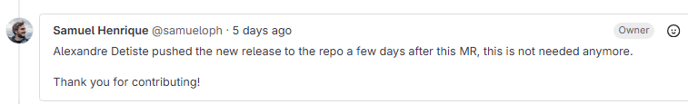
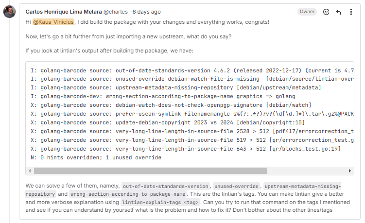

# Kauã Vinícius

## Pacote Mando

O objetivo do pacote era atualizar sua versão upstream, todavia, o seguinte feedback foi enviado:

Sendo assim, o pacote é tratado como encerrado.

## Pacote Golang Barcode

O pacote foi enviado para Merge e recebeu o seguinte feedback:

Com isso, foi aplicado as seguintes alterações na pasta debian/ :

- Overrides eliminados;
- Atualização do repositório padrão do código;
- Mudança no tipo de section de grapics para golang
- Atualização da versão padrão

Após as alterações, foi rodado um sbuild e conferido que estava tudo certo, assim, foram commitadas as alterações. Até o dia 25/01/2025 o MR ainda não foi revisado

## Versão

| Versão |    Data    |         Descrição          |  Autor(es)  |
| :----: | :--------: | :------------------------: | :---------: |
| `1.0`  | 25/01/2025 | Criação de documento | Kauã |
