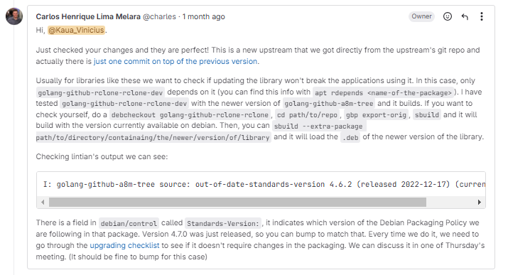
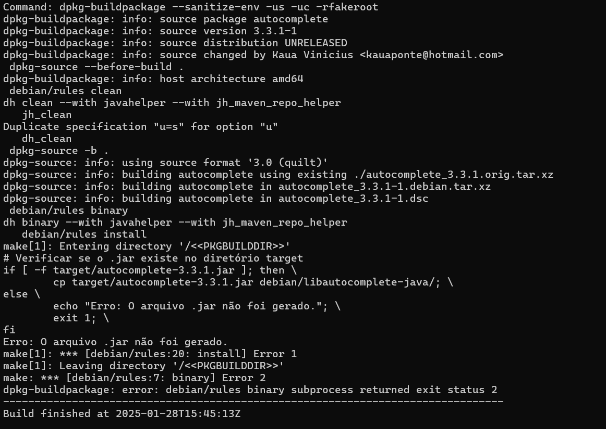

# Kauã Vinícius

## Pacote Mando

O objetivo do pacote era atualizar sua versão upstream, todavia, o seguinte feedback foi enviado:

Sendo assim, o pacote é tratado como encerrado.

## Pacote Golang Barcode

O pacote foi enviado para Merge e recebeu o seguinte feedback:

Com isso, foi aplicado as seguintes alterações na pasta debian/ :

- Overrides eliminados;
- Atualização do repositório padrão do código;
- Mudança no tipo de section de grapics para golang
- Atualização da versão padrão

Após as alterações, foi rodado um sbuild e conferido que estava tudo certo, assim, foram commitadas as alterações. Até o dia 25/01/2025 o MR ainda não foi revisado

## Pacote Golang A8M

O pacote foi enviado para merge e foi retornado com o seguinte feedback:

Com isso, foi atualizado apenas a versão da pasta /debian, além disso, foi atualizado o mesmo de acordo com a seguinte [checklist](https://www.debian.org/doc/debian-policy/upgrading-checklist.html#upgrading-checklist). No dia 29 de janeiro foi solicitado uma alteração quanto a boas práticas de commit, na qual foi atentida.

## Pacote AutoComplete 

O pacote está sendo desenvolvido no exato momento, todavia, enfrenta-se problemas com o java, o mesmo não está querendo gerar o .jar para ser executado pelo sbuild como evidenciado na imagem abaixo:

Atualmente, estou mechendo no arquivo d rules e tentando descobrir o problema dele não estar encontrando o .jar em questão, o arquivo está evidenciado abaixo:

## Versão

| Versão |    Data    |         Descrição          |  Autor(es)  |
| :----: | :--------: | :------------------------: | :---------: |
| `1.0`  | 25/01/2025 | Criação de documento | Kauã |
