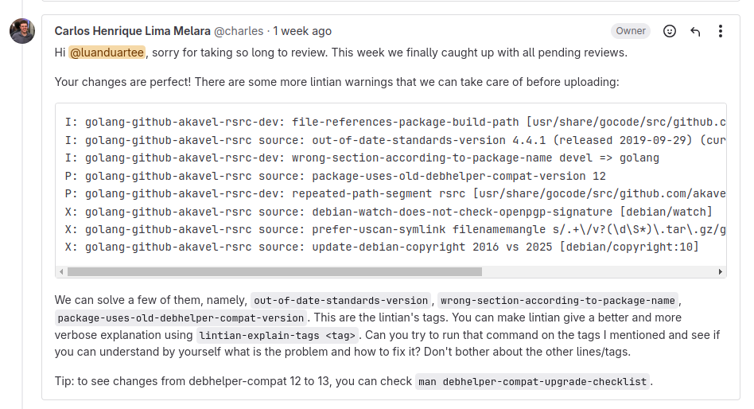
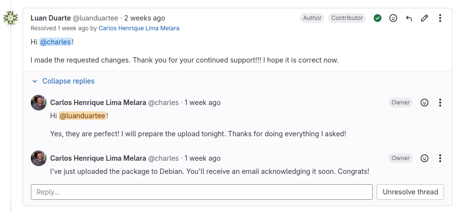

# Luan Mateus

## Pacote golang-github-akavel-rsrc

O pacote tem o objetivo de atualizar a versão upstream. Dessa forma, o Merge Request foi enviado e retornaram o seguinte feedback:

Assim, as modificações foram realizadas no arquivo debian/control, atualizando informações de:

- Build Dependencies
- Section
- Standards-Version

## Pacote golang-github-adrg-xdg

O pacote foi enviado e foi solicitado que algumas alterações fossem feitas no debian/control (Standards-Version).

A alteração foi feita, o build do pacote foi feito novamente e o Merge Request foi enviado. Com isso, o MR foi aceito e a issue foi fechada.

## Pacote python-pika

O pacote tem como objetivo a atualização da versão de upstream. Porém, ao enviar o Merge Request, o seguinte feedback foi retornado:

Dessa forma, o pacote foi tratado como não necessário e a issue foi fechada

## Pacote continuity

Atualmente, o pacote está sendo desenvolvido. A principio era apenas uma atualização de versão do upstream do pacote. Porém, alguns problemas surgiram ao fazer a segunda build, retornando alguns erros de sbuild.

## Versão

| Versão |    Data    |         Descrição          |  Autor(es)  |
| :----: | :--------: | :------------------------: | :---------: |
| `1.0`  | 29/01/2025 | Criação de documento | Luan |
