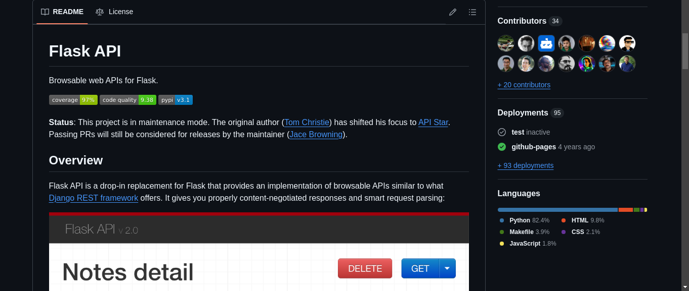
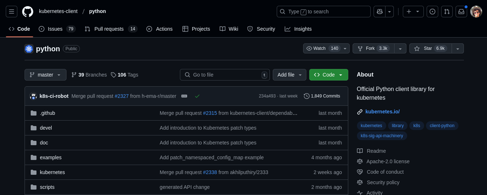
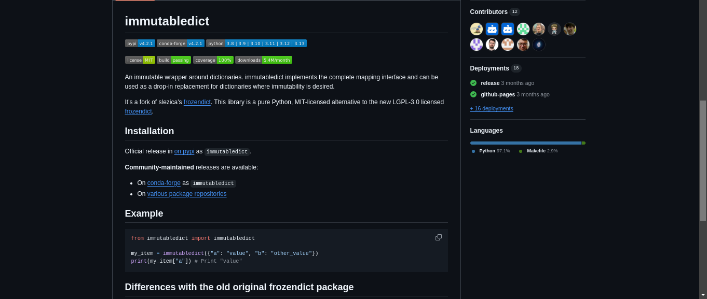

# Bruno Martins

## Pacotes da Sprint 5

### 1. flask-api

- Descrição: 
- Status (12/02/2025 às 02h30): **Review**
- Tipo: Atualização da versão upstream
- Revisores: *Livre*
- Issue [#421](https://salsa.debian.org/debian-brasil-team/docs/-/issues/421)
- [Merge Request](https://salsa.debian.org/python-team/packages/flask-api/-/merge_requests/2)
- Comentários: dificuldade na atualização das bibliotecas de frontend (jquery, bootstrap) utilizadas no projeto.

### 2. python-kubernetes

- Descrição: 
- Status (12/02/2025 às 02h30): **Review**
- Tipo: Atualização da versão upstream
- Revisores: *Livre*
- Issue [#420](https://salsa.debian.org/debian-brasil-team/docs/-/issues/420)
- [Merge Request](https://salsa.debian.org/python-team/packages/python-kubernetes/-/merge_requests/6)
- Comentários: A nova versão deste pacote requeria uma lib do python que não estava presente no ambiente Debian.

### 3. python-immutabledict

- Descrição: 
- Status (12/02/2025 às 02h30): **Review**
- Tipo: Atualização da versão upstream
- Revisores: *Livre*
- Issue [#419](https://salsa.debian.org/debian-brasil-team/docs/-/issues/419)
- [Merge Request](https://salsa.debian.org/python-team/packages/python-immutabledict/-/merge_requests/1)

## Resumo das issues
| Pacotes (issues) assumidos | **To do** | **Doing** | **Review** | **Done (Merged)** |
| :---: | :---: | :---: | :---: | :---: |
| 22 | 1 | 1 | 12 | 6 |

Obs.: Apenas dois MRs foram recusados em razão de outros MRs que já estavam na fila.

## Histórico de Versões
| Versão |    Data    |      Descrição       |                   Autor(es)                   |
| :----: | :--------: | :------------------: | :-------------------------------------------: |
| `1.0`  | 12/02/2025 | Criação de documento | [Bruno Martins](https://github.com/gitbmvb)   |