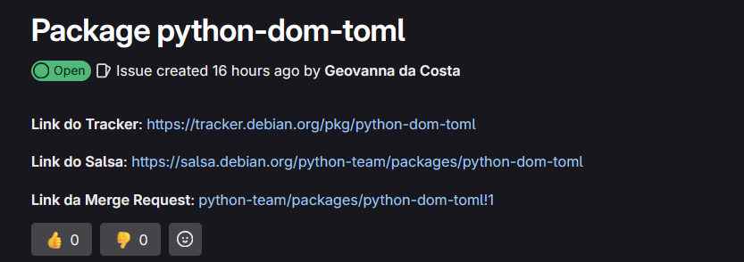
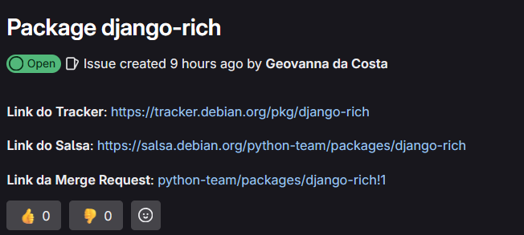
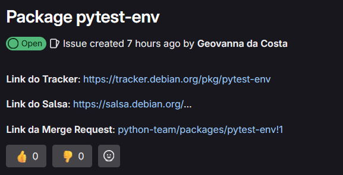
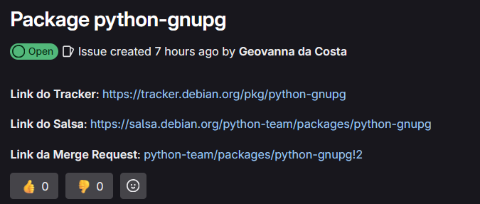
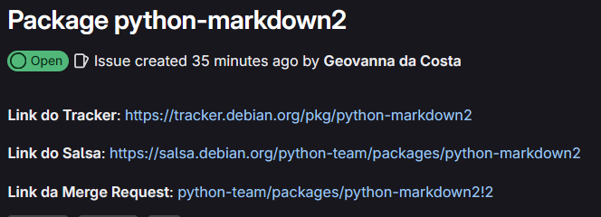

# Geovanna Maciel

## dom_toml - Dom’s tools for Tom’s Obvious, Minimal Language.
O pacote python-dom-toml é uma biblioteca para manipulação de arquivos TOML usando uma abordagem baseada em Document Object Model (DOM). Ele permite carregar, modificar e salvar arquivos TOML mantendo a estrutura e os comentários do documento original.

* MR : [python-team/packages/python-dom-toml!1](python-team/packages/python-dom-toml!1)
* Repositório no Salsa : [https://salsa.debian.org/python-team/packages/python-dom-toml](https://salsa.debian.org/python-team/packages/python-dom-toml)

## Rich Django
A biblioteca django-rich oferece extensões para integrar a biblioteca Rich ao Django, aprimorando a formatação e a exibição de informações no terminal. O Rich é uma biblioteca Python que permite a formatação de texto com cores, renderização de tabelas, barras de progresso, markdown, entre outros, no terminal.

* MR : [python-team/packages/django-rich!1](python-team/packages/django-rich!1)
* Repositório no Salsa : [https://salsa.debian.org/python-team/packages/django-rich](https://salsa.debian.org/python-team/packages/django-rich)

## Pytest-env
O plugin pytest-env permite definir variáveis de ambiente automaticamente ao rodar testes com o pytest. Isso é útil para configurar credenciais, chaves de API, configurações do Django, ou qualquer outra variável necessária para os testes sem precisar defini-las manualmente no sistema operacional ou em scripts.

* MR : [python-team/packages/pytest-env!1](python-team/packages/pytest-env!1)
* Repositório no Salsa : [https://salsa.debian.org/python-team/packages/pytest-env](https://salsa.debian.org/python-team/packages/pytest-env)

## GNU Privacy Guard
O **GNU Privacy Guard** (*gpg*, ou *gpg.exe* no Windows) é um programa de linha de comando que permite a integração com outros sistemas ao ser executado como um processo separado, possibilitando a comunicação com ele a partir de um programa.  

O projeto **python-gnupg** oferece uma biblioteca em Python que abstrai esses detalhes técnicos, permitindo aos usuários criar e gerenciar chaves, criptografar e descriptografar dados, além de assinar e verificar mensagens.

* MR : [python-team/packages/python-gnupg!2](python-team/packages/python-gnupg!2)
* Repositório no Salsa : [https://salsa.debian.org/python-team/packages/python-gnupg](https://salsa.debian.org/python-team/packages/python-gnupg)

## Python-markdown2
O python-markdown2 é uma biblioteca que converte texto escrito em Markdown para HTML. Ele é uma alternativa ao módulo markdown padrão do Python, oferecendo maior velocidade e mais recursos adicionais.

* MR : [python-team/packages/python-markdown2!2](python-team/packages/python-markdown2!2)
* Repositório no Salsa : [https://salsa.debian.org/python-team/packages/python-markdown2](https://salsa.debian.org/python-team/packages/python-markdown2)