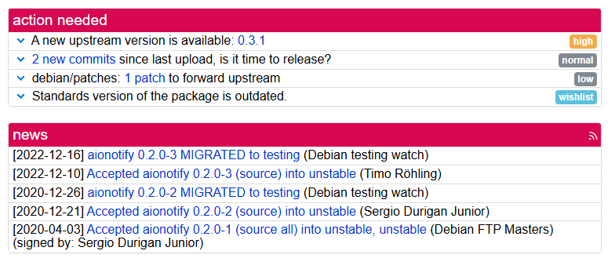

# Kauã Vinícius

## Pacote aionotify

A ideia do pacote é realizar as seguintes tarefas:

Com isso, foi executado o processo padrão de atualização de upstream foi executada com algumas variações:
- Bump do standard-version do Debian;
- Atualização do patch (Com exclusão da pasta);
- Correção dos padrões de arquivo do d/changelog

O Mr está em revisão.

## Pacote Bleak

O pacote apresenta um bug nos patches, ele possui patches para atualizar mas não está presente no tracker.
Sendo assim, a ideia é reportar o bug e atualizar o pacote.

## Versão

| Versão |    Data    |         Descrição          |  Autor(es)  |
| :----: | :--------: | :------------------------: | :---------: |
| `1.0`  | 02/02/2025 | Criação de documento | Kauã |
| `1.0`  | 05/02/2025 | Atualização do documento | Kauã |
