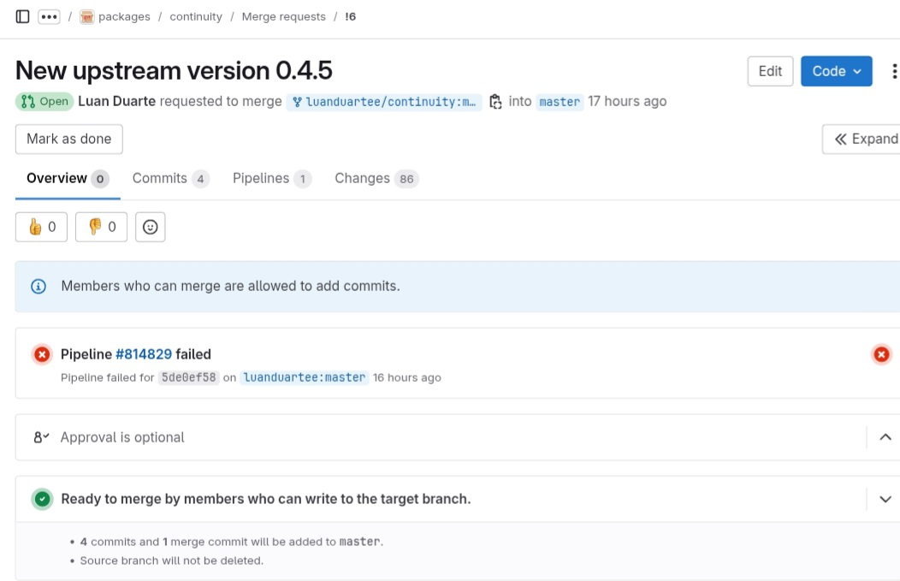

# Luan Mateus

## Pacote golang-github-akavel-rsrc

O pacote tem o objetivo de atualizar a versão upstream. Dessa forma, o Merge Request foi enviado e retornaram o seguinte feedback:

Assim, as modificações foram realizadas no arquivo debian/control, atualizando informações de:

- Build Dependencies
- Section
- Standards-Version

## Pacote continuity

Na sprint passada, o pacote apresentou alguns problemas ao fazer a segunda etapa de build, retornando alguns erros de sbuild. Porém, esses erros foram resolvidos e as atualizações foram enviadas através de um MR para revisão.

## Versão

| Versão |    Data    |         Descrição          |  Autor(es)  |
| :----: | :--------: | :------------------------: | :---------: |
| `1.0`  | 12/02/2025 | Criação de documento | Luan |
