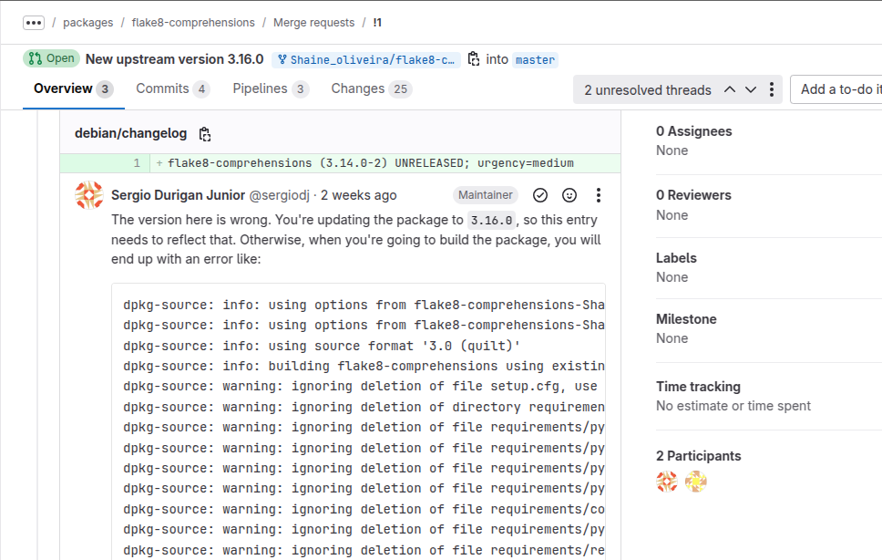
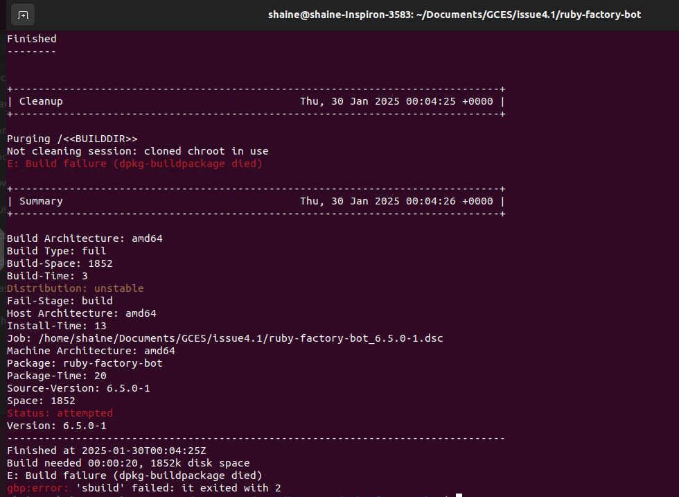
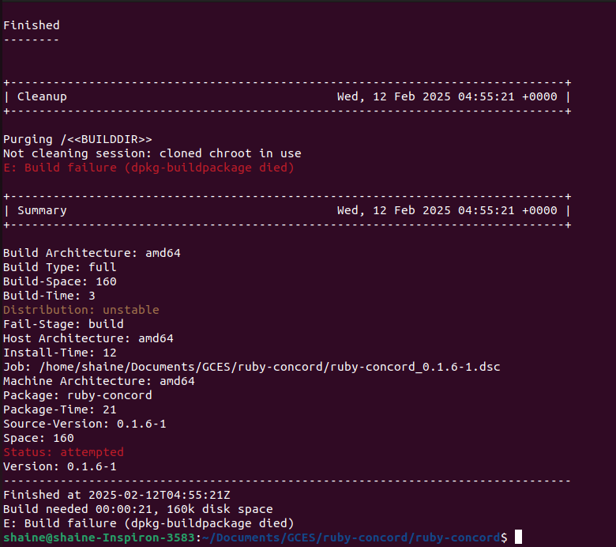

# Shaíne Oliveira

## Issue package flake8-comprehensions #401

## Sobre o pacote

O pacote flake8-comprehensions é um plugin para o Flake8 que ajuda a detectar e sugerir melhorias no uso de comprehensions (listas, dicionários e conjuntos) em Python. Ele sugere substituições para tornar o código mais conciso e idiomático, melhorando a legibilidade e a eficiência.

Por exemplo, ele pode sugerir substituir um for loop explícito por uma list comprehension, ou evitar usos desnecessários de dict() e set(). É útil para manter um código mais limpo e Pythonic.

## Status da issue

- Review

Quando foi executado o comando para gerar a nova versão do changelog, não refletiu para a nova versão. Então, foi corrigido manualmente e solicitado nova revisão.

## Issue Package ruby-factory-bot #375

## Sobre o pacote

O pacote ruby-factory-bot no Debian fornece a gem Factory Bot, que é uma biblioteca para Ruby usada na criação de objetos de teste de maneira simplificada e automatizada.

Ele é muito utilizado em testes automatizados para gerar instâncias de modelos com dados predefinidos, evitando a necessidade de criar objetos manualmente. É especialmente útil em frameworks como RSpec e Rails, facilitando a escrita de testes mais limpos e eficientes.

## Status da issue

- Com problemas

Era necessário tirar uma patch do pacote, mas ao retirar e compilar novamente, constou o seguinte erro:

## Issue Package ruby-concord #270

## Sobre o pacote

O pacote ruby-concord é uma gem (biblioteca) para Ruby que fornece uma maneira simples de definir e manipular a igualdade de objetos e as comparações. Ele permite criar classes que definem de forma clara e eficiente a comparação entre objetos, focando em elementos como igualdade (`==`) e comparação de ordem (`<=>`). Essa gem é útil para quem precisa trabalhar com classes imutáveis ou outras situações onde a comparação precisa ser precisa e concisa. É comumente utilizada em projetos Ruby para tornar o código mais expressivo e reduzir a necessidade de implementação manual de métodos de comparação.

## Status da issue

- Com problemas

O erro indica que o dh_installdocs não conseguiu encontrar o arquivo README.md durante o processo de instalação dos documentos. O motivo mais provável é que o arquivo README.md não está presente no diretório onde o dh_installdocs está procurando, ou que ele não foi incluído corretamente no processo de build:

"   dh_installdocs -O--buildsystem=ruby
dh_installdocs: error: Cannot find (any matches for) "README.md" (tried in ., debian/tmp)

make: *** [debian/rules:7: binary] Error 25
dpkg-buildpackage: error: debian/rules binary subprocess returned exit status 2"

| Versão |    Data    |         Descrição          |  Autor(es)  |
| :----: | :--------: | :------------------------: | :---------: |
| `1.0`  | 12/02/2025 | Criação de documento | [Shaíne Oliveira](https://github.com/ShaineOliveira) |